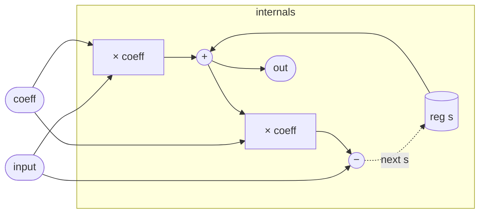

# AllpassDelay

A first-order allpass filter with one sample of internal state. The
transfer function is H(z) = (coeff + z⁻¹) / (1 + coeff·z⁻¹): a
numerator that is the denominator mirrored in coefficient space, which
is the defining property of an allpass. Everywhere on the unit circle
|H(eʲω)| = 1, so the filter passes every frequency at equal power
while rotating its phase by an amount that varies smoothly from 0 to
±π across the spectrum. The exact frequency of maximum phase excursion
is controlled by `coeff`.

Allpass sections are the building block of Schroeder and Moorer reverb
networks, where chains of them produce frequency-smeared feedback that
sounds like early reflections without the comb coloring of a pure delay
line. They also appear in phaser effects (a phaser is an allpass network
summed with dry signal) and in polyphase filter banks.

## Signal flow



## Internals

One register, `s`, threads the previous feedback state into each new
sample. The update unfolds in two steps:

1. **Output.** `out = coeff * input + s` — a weighted mix of the
   current input and the stored state. This is the forward path of
   the allpass lattice.

2. **State writeback.** `next s = input − coeff * out`. The `let`
   binding names the just-computed `out` expression `y` to avoid
   recomputing it, then subtracts the scaled output from the raw
   input. Substituting `y = coeff * input + s`:

   ```
   next s = input − coeff * (coeff * input + s)
          = input * (1 − coeff²) − coeff * s
   ```

   This is the feedback path. The `(1 − coeff²)` factor keeps the
   loop gain below unity when |coeff| < 1, ensuring bounded output.
   If |coeff| ≥ 1 the loop diverges.

The allpass property follows from the z-domain form. With S(z) denoting
the z-transform of `s` (the one-sample delay):

```
Y(z) = coeff·X(z) + S(z)
S(z)·z = X(z) − coeff·Y(z)
```

Eliminating S gives H(z) = Y/X = (coeff + z⁻¹) / (1 + coeff·z⁻¹).
Since numerator and denominator are coefficient-mirror images of each
other, |H(eʲω)| = 1 identically — the allpass identity holds for any
real `coeff` with |coeff| < 1.

## Source

```tropical
program AllpassDelay(input: signal = 0, coeff: float = 0.5) -> (out: signal) {
  reg s = 0
  out = coeff * input + s
  next s = let { y: coeff * input + s } in input - coeff * y
}
```
