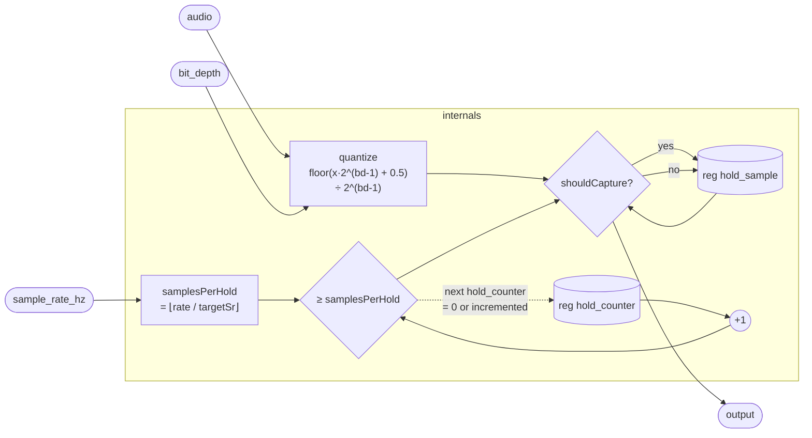

# BitCrusher

A classic lo-fi effect combining two independent degradations: **bit crushing**
(reducing amplitude resolution by quantizing to a coarser grid) and **sample-rate
crushing** (reducing temporal resolution by freezing the output between periodic
captures). Either effect can be dialled to its maximum-quality limit —
`bit_depth = 24`, `sample_rate_hz = sampleRate()` — leaving the other to do all
the work.

The combination of the two is what gives vintage samplers, early game-console
audio chips, and circuit-bent hardware their characteristic grit: coarse amplitude
steps create harmonic distortion while the staircase texture from low effective
sample rates creates aliasing and a roughened transient shape.

## Signal flow



## Internals

### Bit depth quantization

`bd` is clamped to `[1, 24]`. The number of quantization levels per sign is:

```
levels = ldexp(1, bd - 1) = 2^(bd-1)
```

So at `bd = 8`, `levels = 128`, and the audio range `[−1, 1]` maps to 256 steps
total — matching the amplitude resolution of an 8-bit unsigned PCM word. The
quantization itself is midtread round-to-nearest:

```
quantized = floorDiv(audio * levels + 0.5, 1) / levels
```

`floorDiv(x, 1)` is identical to `floor(x)`, so the expression is
`floor(audio · levels + 0.5) / levels` — multiply to integer scale, add 0.5 so
that `floor` rounds to the nearest integer rather than truncating, then scale back.
This is a symmetric, unbiased quantizer at all bit depths.

### Sample rate decimation

`targetSr` is clamped to `[1, sampleRate()]`. The integer decimation ratio is:

```
samplesPerHold = clamp(floorDiv(sampleRate(), targetSr), 1, 44100)
```

`floorDiv` gives the integer number of native samples per target-rate period. The
upper clamp of 44100 bounds `samplesPerHold` to at most one second of freeze, which
prevents the counter from running away if `sample_rate_hz` is set to 0 after the
clamp catches it at 1. At `targetSr = sampleRate()` the ratio is 1 and every
native sample is a capture event — no effective rate reduction.

### Sample-and-hold state machine

`hold_counter` increments each tick. When `incremented = hold_counter + 1` reaches
`samplesPerHold`, `shouldCapture` is true:

- `output` / `next hold_sample` → `select(shouldCapture, quantized, hold_sample)`:
  on a capture tick, latch the freshly quantized value; otherwise hold the previous
  frozen sample.
- `next hold_counter` → `select(shouldCapture, 0, incremented)`: on a capture tick,
  reset to 0; otherwise advance the counter.

`output` and `next hold_sample` are the same expression, so the output is always
identical to the value being stored — there is no extra sample of latency between
what is latched and what is heard.

Note that the quantization computation is duplicated verbatim across the `output`,
`next hold_sample`, and (partially) `next hold_counter` bindings. This is an
artefact of the language's let-binding scoping in the single-assignment body: the
compiler's CSE pass will deduplicate the shared sub-expressions before they reach
the kernel.

## Source

```tropical
program BitCrusher(
  audio = 0,
  bit_depth = 24,
  sample_rate_hz = 44100
) -> (output) {
  reg hold_sample = 0
  reg hold_counter = 0
  output = let {
      bd: clamp(bit_depth, 1, 24);
      targetSr: clamp(sample_rate_hz, 1, sampleRate())
    } in let {
      levels: ldexp(1, bd - 1);
      samplesPerHold: clamp(floorDiv(sampleRate(), targetSr), 1, 44100);
      incremented: hold_counter + 1
    } in let {
      quantized: floorDiv(audio * levels + 0.5, 1) / levels;
      shouldCapture: incremented >= samplesPerHold
    } in select(shouldCapture, quantized, hold_sample)
  next hold_sample = let {
      bd: clamp(bit_depth, 1, 24);
      targetSr: clamp(sample_rate_hz, 1, sampleRate())
    } in let {
      levels: ldexp(1, bd - 1);
      samplesPerHold: clamp(floorDiv(sampleRate(), targetSr), 1, 44100);
      incremented: hold_counter + 1
    } in let {
      quantized: floorDiv(audio * levels + 0.5, 1) / levels;
      shouldCapture: incremented >= samplesPerHold
    } in select(shouldCapture, quantized, hold_sample)
  next hold_counter = let {
      targetSr: clamp(sample_rate_hz, 1, sampleRate())
    } in let {
      samplesPerHold: clamp(floorDiv(sampleRate(), targetSr), 1, 44100);
      incremented: hold_counter + 1
    } in let {
      shouldCapture: incremented >= samplesPerHold
    } in select(shouldCapture, 0, incremented)
}
```
