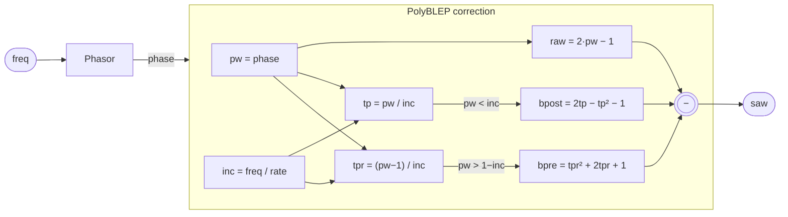

# BlepSaw

A sawtooth oscillator with a PolyBLEP (Polynomial Band-Limited Step) correction applied
at the phase discontinuity. A naive sawtooth — a linear ramp from −1 to +1 that resets
abruptly — aliases badly at audio frequencies because the hard discontinuity has energy
at all harmonics. PolyBLEP replaces the two samples straddling the wrap point with a
smooth polynomial residual that approximates what a sinc-based band-limited step would
produce, suppressing the highest-aliased partials without a brick-wall filter or
oversampling.

The result is not alias-free (it is two-point / first-order PolyBLEP, not full sinc), but
the correction is cheap — a handful of multiply-adds in the kernel — and audibly effective
up to roughly one quarter of the Nyquist frequency. Above that, a higher-order correction
or oversampling is needed.

## Signal flow



## Internals

**Phasor.** The oscillator delegates its phase accumulation to `Phasor`, which wraps a
register from 0 to 1 at a rate of `freq / sampleRate()` per sample. The output `ph.phase`
is the current phase value before it is incremented, so the ramp is read-then-advance.

**Naive sawtooth.** `raw = 2 * pw - 1` maps phase [0, 1) linearly to amplitude [−1, +1).
This is the uncompensated waveform — correct everywhere except at the wrap discontinuity.

**Normalized phase increment.** `inc = freq / sampleRate()` is the phase step per sample
and equals the width of one sample in normalized-phase units. It is the key parameter for
the PolyBLEP correction: the correction window is exactly one sample wide on each side of
the discontinuity.

**Post-discontinuity correction (`bpost`).** When `pw < inc` the oscillator is in the
first sample after the phase wrap. The local time `tp = pw / inc` runs from 0 at the
exact wrap moment to 1 at the end of that sample. The residual `2·tp − tp² − 1` is the
standard first-order PolyBLEP polynomial for t ∈ [0, 1); it is zero at t = 0 and t = 1
and negative in between (it pulls the raw ramp downward to soften the rising edge of the
step).

**Pre-discontinuity correction (`bpre`).** When `pw > 1 − inc` the oscillator is in the
last sample before the wrap. The local time `tpr = (pw − 1) / inc` runs from −1 at the
start of that sample to 0 at the end (the wrap boundary). The residual `tpr² + 2·tpr + 1`
= `(tpr + 1)²` is the PolyBLEP polynomial for t ∈ [−1, 0]; it is zero at t = −1 and
t = 0 and positive in between (it lifts the raw ramp to soften the falling approach to
the wrap).

**Final output.** `saw = raw − bpost − bpre`. Both corrections are subtracted because
the ramp discontinuity is a negative-going step in the signal derivative (the waveform
jumps from +1 back to −1), and both polynomials are already signed to correct that
direction. Outside their respective windows the `select` guards force the correction
terms to zero, so only one window is ever active per sample (they cannot overlap unless
`inc > 0.5`, i.e., freq > Nyquist/2, at which point the correction degrades gracefully).

The `let` block in the source is a local-binding form that avoids recomputing `inc`,
`pw`, `tp`, and `tpr`; the compiler inlines all bindings so there is no runtime overhead.

## Source

```tropical
program BlepSaw(freq: freq = 440) -> (saw: signal) {
  ph = Phasor(freq: freq)
  saw = let {
      inc: freq / sampleRate();
      pw: ph.phase;
      raw: 2 * pw - 1;
      tp: pw / inc;
      tpr: (pw - 1) / inc;
      bpost: select(pw < inc, 2 * tp - tp * tp - 1, 0);
      bpre: select(pw > 1 - inc, tpr * tpr + 2 * tpr + 1, 0)
    } in raw - bpost - bpre
}
```
