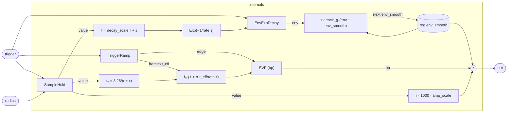

# Bubble

A single-voice bubble synthesiser grounded in Minnaert resonance physics.
When a trigger fires, the program latches the current `radius`, computes a
natural resonant frequency inversely proportional to that radius, and drives
a state-variable filter bandpass with an exponentially decaying envelope.
As the bubble nominally "collapses" over its lifetime, the resonant
frequency chirps upward — modelling a shrinking bubble. Amplitude is
proportional to bubble radius (larger bubbles radiate more acoustic energy).
The result is a pitched, decaying tone with the character of a real
underwater bubble pop: high-Q, brief, with a rising-pitch tail.

## Signal flow



## Internals

### Radius latch

`SampleHold` captures `radius` on each trigger edge and holds it constant
for the bubble's lifetime. This means changing `radius` between triggers
selects the next bubble's size without affecting the one currently ringing.
All downstream computations — frequency, decay, amplitude — read
`hold.value`, the latched radius.

### Resonant frequency and chirp

The base resonant frequency follows the Minnaert approximation: a bubble's
natural frequency is inversely proportional to its radius,

    f₀ = 3.26 / (r + ε)

where `ε = 0.000001` guards against division by zero. The constant `3.26`
is a condensed form of the Minnaert coefficient (exact value depends on
water density, surface tension, and adiabatic index; `3.26` gives
perceptually plausible bubble pitches in the range of small air bubbles in
water). A bubble of radius 0.001 m (1 mm) produces a base frequency around
3260 Hz; 0.01 m (1 cm) drops to ~326 Hz.

The cutoff fed to the SVF rises linearly over time:

    cutoff(t) = f₀ · (1 + σ · t_eff / (rate · τ))

where `t_eff` is `ramp.frames` — the integer sample count since the trigger
— and `τ = decay_scale · r` is the decay time constant in seconds. At
`t_eff = 0` the cutoff is exactly `f₀`; after one time constant's worth of
samples it has risen by a factor of `(1 + σ)`. This models a bubble that
contracts as it loses energy, shifting its resonance upward. `sigma`
controls the slope: `sigma = 0` gives a static pitch, larger values produce
a more audible glide.

### Amplitude envelope

`decay_calc` converts the time constant τ into a per-sample exponential
decay coefficient using the stdlib `Exp`:

    decay_coeff = exp(−1 / (rate · τ))

This is the standard `e^(−1/τ_samples)` pole placement for a one-pole
exponential decay. `EnvExpDecay` uses this coefficient: on a trigger edge
it resets its internal level to 1.0 and each subsequent sample multiplies
by `decay_coeff`, yielding a falling exponential `e^(−n/(rate·τ))` after n
samples. Larger bubbles (larger `r`) have a longer τ and therefore a
slower-decaying envelope.

### Envelope smoother and output

`env_smooth` is a one-pole attack smoother applied to the envelope:

    next env_smooth = env_smooth + attack_g · (env − env_smooth)

This softens the onset of each bubble, reducing the click that would occur
if the envelope jumped from 0 to 1 instantaneously. `attack_g ≈ 0.05`
corresponds to a short attack smear; larger values bring the onset closer
to abrupt.

The SVF receives the trigger's rising edge (`ramp.edge`) as its input signal
— a one-sample impulse that excites the resonator. The bandpass output
`svf.bp` rings at the chirping cutoff frequency. The final output multiplies
the smoothed envelope, the bandpass signal, and a radius-proportional
amplitude factor:

    out = env_smooth · svf.bp · (radius_held · 1000 · amp_scale)

The factor `radius · 1000` implements the physical intuition that a larger
bubble displaces more fluid and radiates a stronger acoustic pulse;
`amp_scale` is a user-facing trim.

## Source

```tropical
program Bubble(trigger: signal = 0, radius: float = 0.001, q: float = 30, sigma: float = 0.3, decay_scale: float = 10, amp_scale: float = 1, attack_g: float = 0.05) -> (out: float) {
  reg env_smooth = 0
  hold = SampleHold(trigger: trigger, input: radius)
  ramp = TriggerRamp(trigger: trigger)
  decay_calc = Exp(x: -1 / (sampleRate() * (decay_scale * hold.value + 0.000001)))
  env_gen = EnvExpDecay(trigger: trigger, decay: decay_calc.out)
  svf = SVF(input: ramp.edge, cutoff: let { r_held: hold.value; t_eff: ramp.frames } in let { tau: decay_scale * r_held + 0.000001; f0: 3.26 / (r_held + 0.000001) } in f0 * (1 + sigma * t_eff / (sampleRate() * tau)), q: q)
  out = env_smooth * svf.bp * (hold.value * 1000 * amp_scale)
  next env_smooth = env_smooth + attack_g * (env_gen.env - env_smooth)
}
```
