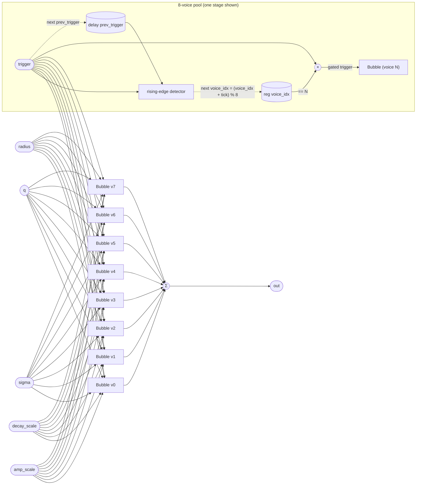

# BubbleCloud

A polyphonic bubble synthesizer built from eight `Bubble` voices arranged
in a round-robin pool. Every rising edge on `trigger` advances a voice
pointer and fires exactly that voice; the seven idle voices continue their
natural decays undisturbed. The outputs of all eight voices are mixed
together each sample, so overlapping bubbles blend freely while the
voice-stealing logic ensures no single voice is re-triggered before it has
had a chance to ring out (given sparse enough triggering).

Because tropical uses fixed-topology compilation, all eight `Bubble`
instances run per sample regardless of whether they are active. The
"selection" is accomplished by gating the trigger: each voice receives
`trigger * (voice_idx == N)`, which is 0 on every sample except the one
where that voice is chosen — so only the selected voice sees a non-zero
trigger, and only that voice restarts its envelope and resonator.

## Signal flow



## Internals

**Rising-edge detection.** `prev_trigger` is a unit delay of `trigger`.
Each sample, the expression `(trigger > 0.5) * (prev_trigger <= 0.5)`
evaluates to 1 exactly on the first sample where `trigger` crosses the
0.5 threshold upward, and 0 on all other samples. This `tick` value (0
or 1) is added to `voice_idx` before the modulo-8 wrap, so the pointer
advances by at most 1 per sample regardless of how wide the trigger pulse
is.

**Round-robin allocation.** `voice_idx` is an integer register that
cycles 0 → 1 → … → 7 → 0. On the sample where a rising edge is
detected, `voice_idx` already holds the index of the voice that will
receive this trigger (the update happens at the *end* of the sample via
`next voice_idx`), so the gating expression `trigger * (voice_idx == N)`
uses the *current* (pre-update) pointer. The net effect is: the first
trigger fires voice 0, the second fires voice 1, and so on.

**Per-voice gating.** The gated trigger `trigger * (voice_idx == N)` is
either the full trigger signal (when this voice is selected) or exactly 0
(all other samples). `Bubble` interprets a positive trigger as a
re-onset: it restarts its envelope and resets the frequency sweep. An
already-decaying voice whose gate is 0 simply continues its decay
unaffected, contributing its tail to the mix.

**Output summing.** The eight voice outputs are summed in a
parenthesized tree. The grouping is asymmetric (`(v6.out + v7.out)` is
nested inside a deeper sub-expression) but the result is associative and
the grouping has no audible or numerical significance beyond how the
compiler schedules the additions.

**No `attack_g` forwarding.** `BubbleCloud` does not expose `Bubble`'s
`attack_g` parameter; the default value (0.05) is used for every voice.
This gives a fixed ~20-sample envelope attack regardless of other
settings.

## Source

```tropical
program BubbleCloud(trigger: signal = 0, radius: float = 0.001, q: float = 30, sigma: float = 0.3, decay_scale: float = 10, amp_scale: float = 0.05) -> (out: float) {
  reg voice_idx: int = 0
  delay prev_trigger = trigger init 0
  v0 = Bubble(trigger: trigger * (voice_idx == 0), radius: radius, q: q, sigma: sigma, decay_scale: decay_scale, amp_scale: amp_scale)
  v1 = Bubble(trigger: trigger * (voice_idx == 1), radius: radius, q: q, sigma: sigma, decay_scale: decay_scale, amp_scale: amp_scale)
  v2 = Bubble(trigger: trigger * (voice_idx == 2), radius: radius, q: q, sigma: sigma, decay_scale: decay_scale, amp_scale: amp_scale)
  v3 = Bubble(trigger: trigger * (voice_idx == 3), radius: radius, q: q, sigma: sigma, decay_scale: decay_scale, amp_scale: amp_scale)
  v4 = Bubble(trigger: trigger * (voice_idx == 4), radius: radius, q: q, sigma: sigma, decay_scale: decay_scale, amp_scale: amp_scale)
  v5 = Bubble(trigger: trigger * (voice_idx == 5), radius: radius, q: q, sigma: sigma, decay_scale: decay_scale, amp_scale: amp_scale)
  v6 = Bubble(trigger: trigger * (voice_idx == 6), radius: radius, q: q, sigma: sigma, decay_scale: decay_scale, amp_scale: amp_scale)
  v7 = Bubble(trigger: trigger * (voice_idx == 7), radius: radius, q: q, sigma: sigma, decay_scale: decay_scale, amp_scale: amp_scale)
  out = v0.out + v1.out + (v2.out + v3.out) + (v4.out + v5.out + (v6.out + v7.out))
  next voice_idx = let { tick: (trigger > 0.5) * (prev_trigger <= 0.5) } in (voice_idx + tick) % 8
}
```
