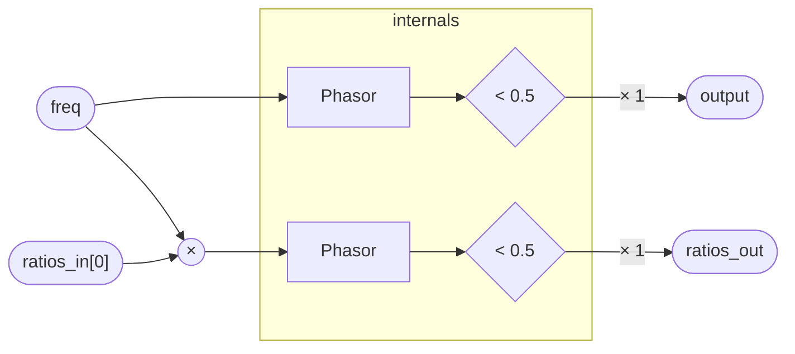

# Clock

A square-wave clock derived from two `Phasor` instances. The primary output
fires at `freq` Hz; the ratio channel fires at `freq × ratios_in[0]` Hz,
producing a synchronized sub- or super-clock at any rational or irrational
multiple of the master rate. The threshold comparison `(phase < 0.5) * 1`
converts each phasor's `[0, 1)` ramp into a 50% duty-cycle gate: high for
the first half of the cycle, low for the second.

The `ratios_in` / `ratios_out` pair uses a `float[1]` array rather than a
bare scalar so that multiple Clock instances can be chained in series —
feeding one instance's `ratios_out` into the next instance's `ratios_in` —
without requiring a dedicated ratio-accumulation program. At array size 1 the
overhead is identical to a scalar; the array wrapper is purely a wiring
convention.

## Signal flow



## Internals

Clock has no state of its own; all phase accumulation lives inside the two
`Phasor` instances.

- `ph0` runs a phasor at the raw `freq` input. Its `.phase` output is a
  sawtooth ramp in `[0, 1)` that resets once per period.
- `ph1` runs a second, independent phasor at `freq * ratios_in[0]`. When
  `ratios_in[0]` is an integer n, `ph1` completes n cycles for every one
  cycle of `ph0`. Fractional or irrational ratios produce polyrhythmic gates
  that drift in and out of phase alignment over time.
- The comparison `(phase < 0.5) * 1` is a branchless 0/1 conversion: the
  boolean result is multiplied by 1 to produce a `unipolar` scalar rather
  than a raw boolean. Both `output` and each element of `ratios_out` are
  produced this way.

The default `ratios_in = [1]` makes `ph1` an exact copy of `ph0`, so both
outputs fire in lockstep. Patching `ratios_in[0] = 2` doubles the ratio
channel's rate; `0.5` halves it.

## Source

```tropical
program Clock(freq: freq = 1, ratios_in: float[1] = [1]) -> (output: unipolar, ratios_out: float[1]) {
  ph0 = Phasor(freq: freq)
  ph1 = Phasor(freq: freq * ratios_in[0])
  output = (ph0.phase < 0.5) * 1
  ratios_out = [(ph1.phase < 0.5) * 1]
}
```
