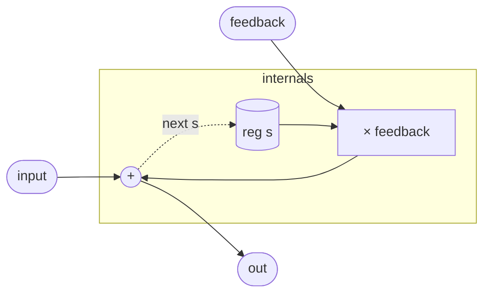

# CombDelay

A minimal IIR comb filter with a one-sample delay tap. Each output sample
is the current input plus a scaled copy of the previous output:

    out[n] = input[n] + feedback · out[n−1]

This is a single-pole IIR with unity feedforward. In the z-domain the
transfer function is `H(z) = 1 / (1 − feedback·z⁻¹)`, a first-order
recursive filter whose pole sits on the real axis at `z = feedback`. At
audio rates a one-sample delay is far too short to hear as an echo (it is
roughly 20 µs at 48 kHz), so the audible effect is coloration rather than
discrete repetition: the feedback accumulates successive inputs, boosting
low-frequency energy and shaping the spectral envelope. With `feedback`
near 1 the filter approaches an integrator; with `feedback` near −1 it
becomes a gentle high-frequency resonator.

Because the only delay is a single sample, this module is better understood
as a resonant building block than a chorus or delay line. For longer delay
taps see `Delay` (parametric sample-accurate buffer) or `AllpassDelay`
(unit-delay allpass section).

## Signal flow



## Internals

One register, `s`, holds the previous output. Each sample:

1. `feedback * s` scales the stored previous output by the feedback
   coefficient.
2. `input + feedback * s` sums the current input with the scaled feedback
   — this is `out`.
3. `next s` writes the same expression back as the new state, so `s` at
   sample `n+1` equals `out` at sample `n`.

Both `out` and `next s` evaluate the same expression, so there is no
extra latency between what is output and what gets fed back: the feedback
loop is unit-delay only (one sample), not two.

Stability requires `|feedback| < 1`. At `feedback = 0` the filter reduces
to a wire; at `feedback = 0.7` (the default) successive outputs decay
roughly as `0.7^k`, dropping to half-power after about two samples — a
very fast exponential that adds warmth without obvious tail.

## Source

```tropical
program CombDelay(input: signal = 0, feedback: float = 0.7) -> (out: signal) {
  reg s = 0
  out = input + feedback * s
  next s = input + feedback * s
}
```
