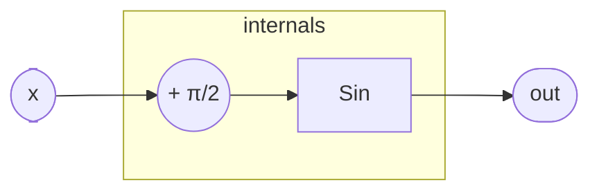

# Cos

Cosine evaluated by phase-shifting the argument by π/2 and delegating
to `Sin`. The identity cos(x) = sin(x + π/2) is exact, so no
approximation is introduced here — all the numerical machinery lives
in `Sin`.

## Signal flow



## Internals

The only computation in this program is the constant phase offset
`1.5707963267948966`, which is IEEE 754 double-precision π/2.
Adding it to `x` before passing to `Sin` exploits the trigonometric
co-function identity:

    cos(x) = sin(x + π/2)

`Sin` handles arbitrary real inputs through period reduction: it
multiplies by 1/π (`0.3183098861837907`), rounds to the nearest
integer `n`, subtracts `n·π` to obtain a remainder `r` in (−π/2, π/2],
applies a sign flip when `n` is odd, and evaluates a degree-11 minimax
polynomial in r². The six polynomial coefficients are scaled Taylor
coefficients for sin(r)/r, giving roughly 15 decimal digits of
accuracy across the real line. See `Sin.md` for the full breakdown.

Because `Cos` adds exactly one floating-point constant and introduces
no state of its own, its per-sample cost is identical to `Sin`: a
handful of scalar multiplies, an integer round, a bitwise AND, and the
polynomial Horner evaluation — no transcendental hardware instruction
is called.

## Source

```tropical
program Cos(x: float = 0) -> (out: float) {
  sin = Sin(x: x + 1.5707963267948966)
  out = sin.out
}
```
