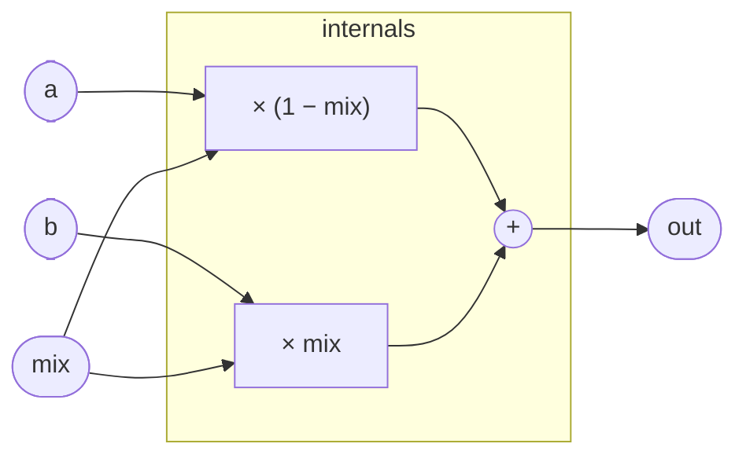

# CrossFade

A single-expression linear interpolator. Given two signals `a` and `b`
and a blend position `mix` in the unit interval, the output is:

```
out = (1 − mix) · a  +  mix · b
```

This is the standard convex combination — the coefficients `(1 − mix)`
and `mix` always sum to 1, so the operation is gain-preserving for
coherent signals. There is no state, no smoothing, and no nonlinearity:
whatever drives `mix` determines the blend trajectory entirely.

Common uses: dry/wet mixing after a processor, morphing between two
oscillator waveforms, or as the selection primitive inside larger
programs that need a soft or modulated switch.

Note that equal-amplitude crossfade (`mix = 0.5`) does not conserve
power — each side is attenuated by 0.5, not 1/√2 — so if you are
fading between uncorrelated signals and want constant perceived loudness,
you need an equal-power crossfade (cosine/sine law) instead. For
correlated or in-phase material the linear blend is usually correct.

## Signal flow



## Internals

There is no register and no feedback. Each sample, the kernel evaluates
`(1 - mix) * a + mix * b` as a pair of multiply-add operations and
writes the result to `out`. The `unipolar` annotation on `mix` is a
clamp hint (`mix in [0, 1]`); values outside that range are valid DSP
(extrapolation/overdrive of the blend) but the port annotation signals
the intended domain.

## Source

```tropical
program CrossFade(a: signal = 0, b: signal = 0, mix: unipolar = 0.5) -> (out: signal) {
  out = (1 - mix) * a + mix * b
}
```
