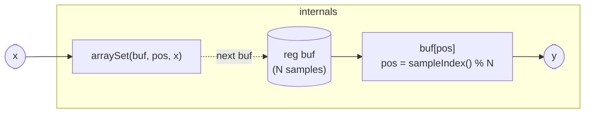

# Delay

A fixed-length ring-buffer delay line, generic in its buffer length `N`.
Each sample the program reads the value stored at the current write
position — which is exactly the input sample from N ticks ago — then
immediately overwrites that slot with the new input. This read-before-write
ordering means the output is always N samples old, never the current one,
which is why the program is safe to use in feedback paths: there is no
same-sample dependency between `y` and `x`.

The `breaks_cycles` annotation on the signature is the formal declaration
of that safety contract. The elaborator's cycle tracer stops at any
`breaks_cycles` boundary rather than propagating a cycle error through it,
so `Delay` can appear in the back-edge of a feedback loop — for example,
feeding a filter's output back into its input — without triggering
`CycleViolation`. Every wire that crosses an MCP session boundary gains
exactly one sample of latency by similar reasoning; `Delay<N>` generalises
that to an arbitrary N-sample pipeline.

At the default `N = 44100` the buffer holds one second of audio at
44.1 kHz (or ~917 ms at 48 kHz). At `N = 1` the program degrades to a
unit-delay register, equivalent to the elaborator's own per-wire delay
primitive. Intermediate values give tuned delays: `N ≈ rate / freq`
produces a comb resonance at `freq` Hz, which is the basis of
`CombDelay` and `AllpassDelay`.

## Signal flow



Read occurs before write: on each tick `pos = sampleIndex() % N` selects
the ring-buffer slot. The current contents of that slot are emitted as
`y`, then the slot is overwritten with `x`. The dotted arrow shows the
state writeback that closes the ring on the next tick.

## Internals

The entire delay lives in one register: `buf`, a float array of length N
initialized to zeros.

`sampleIndex()` is a monotonically increasing ambient source — the global
sample counter since the kernel started. Taking it modulo N maps the
unbounded counter onto the ring: slot 0, 1, …, N−1, 0, 1, …

On sample `t`:

1. **Read.** `y = buf[t % N]` — retrieves whatever was stored at this
   slot the last time the counter landed here, which was `t − N` ticks
   ago. For `t < N` the slot still holds its zero-init value, so the
   first N output samples are always zero regardless of input.

2. **Write.** `next buf = arraySet(buf, t % N, x)` — stores the current
   input at the same slot, so it will be read back N ticks from now.

Because the read expression (`y = buf[...]`) appears before the write
(`next buf = ...`), there is no combinational dependency of `y` on `x` in
the same sample. The compiler sees a pure register read in the forward
path and a register writeback (old value → new value) that takes effect on
the following tick. This is what makes `breaks_cycles` true by
construction: any feedback signal routed through `y` back to `x` is
delayed by at least one full buffer period (minimum one sample when N = 1).

`arraySet` returns a new array value with one element replaced; the
compiler's array lowering unrolls this into a slot-vector update at
compile time when N is small and statically known, and into an in-place
indexed write in the runtime slot layout otherwise.

## Source

```tropical
program Delay<N: int = 44100>(x = 0) -> (y) breaks_cycles {
  reg buf = zeros(N)
  y = buf[sampleIndex() % N]
  next buf = arraySet(buf, sampleIndex() % N, x)
}
```
