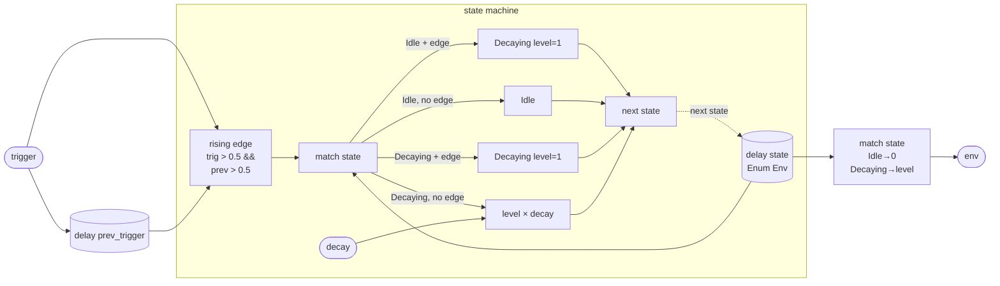

# EnvExpDecay

A retriggerable exponential-decay envelope with an explicit two-state machine. In the `Idle` phase the output is zero and the envelope draws no compute cost beyond the edge-detector comparison. A rising edge on `trigger` (below 0.5 one sample, above 0.5 the next) moves the machine to `Decaying` and sets the level to 1.0. Each subsequent sample the level is multiplied by `decay`, producing a geometric series — the discrete-time equivalent of `e^(−t/τ)` — until another trigger retriggers from the top or, if `decay < 1` strictly, the level decays toward zero while the machine stays in `Decaying`.

There is no explicit `Idle`-return threshold: the machine remains in `Decaying` indefinitely after a trigger. For most synthesis contexts this is correct — a retriggered envelope that was already decaying jumps back to full amplitude rather than stitching together two partial decays.

The rising-edge detector (`trigger > 0.5 && prev_trigger <= 0.5`) is a one-sample hysteretic comparator that fires exactly once per gate-on event regardless of how long the gate stays high.

## Signal flow



## Internals

**Edge detection.** `prev_trigger` is a `delay` register seeded at 0. Each sample it holds the previous sample's trigger value. The rising-edge condition `trigger > 0.5 && prev_trigger <= 0.5` is true for exactly one sample at each gate-on transition, so a sustained gate triggers once and a fast pulse triggers once — both produce identical envelope trajectories.

**State register.** `state` is a `delay` register whose type is the inline `Enum Env { Idle, Decaying(level: float) }`. This sum type carries the machine phase and the payload — the current amplitude — in a single register. Initialised to `Idle {}`.

**Transition logic.** A single `match state` expression covers all four cases:

| Current state | Rising edge? | Next state |
|---|---|---|
| `Idle` | yes | `Decaying { level: 1 }` |
| `Idle` | no | `Idle {}` |
| `Decaying { level }` | yes | `Decaying { level: 1 }` (retrigger) |
| `Decaying { level }` | no | `Decaying { level: level * decay }` |

The `select` primitive inside each branch is the compiler's way to merge the two edge/no-edge sub-cases into a single branchless select while keeping the surrounding `match` for variant discrimination.

**Output.** `env` is extracted by a second `match state`: `Idle` maps to 0, `Decaying` maps to its `level` payload. Because `state` is a `delay` register, `env` lags one sample behind the trigger — the first sample of decay-from-1 is emitted the cycle after the rising edge.

**Time constant.** The level after `n` samples is `decay^n`. The time constant `τ` in seconds satisfies `decay = e^(−1/(τ·rate))`, so `τ = −1 / (rate · ln(decay))`. At 48 kHz: `decay = 0.999` → τ ≈ 20.8 s; `decay = 0.99` → τ ≈ 2.1 s; `decay = 0.9` → τ ≈ 197 ms. There is no lower floor — the level decays toward zero asymptotically and `Decaying` is never automatically retired back to `Idle`.

## Source

```tropical
program EnvExpDecay(trigger: signal = 0, decay: float = 0.999) -> (env: signal) {
  enum Env { Idle, Decaying(level: float) }
  delay prev_trigger = trigger init 0
  delay state: Env = match state { Idle => select(trigger > 0.5 && prev_trigger <= 0.5, Decaying { level: 1 }, Idle { }), Decaying { level: level } => select(trigger > 0.5 && prev_trigger <= 0.5, Decaying { level: 1 }, Decaying { level: level * decay }) } init Idle { }
  env = match state { Idle => 0, Decaying { level: level } => level }
}
```
