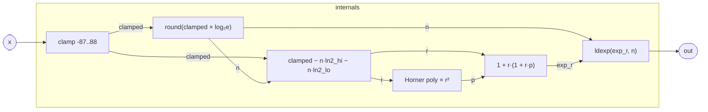

# Exp

A scalar `e^x` implementation built entirely from polynomial arithmetic and
integer bit manipulation. It is used wherever the kernel needs a true
exponential — envelope curves, FM frequency scaling, log-domain mixing — without
paying for a hardware `exp` instruction or a libm call.

The algorithm follows the classical range-reduction strategy: split the
computation into an integer power of two (exact, via `ldexp`) and a
reduced-range `exp` that only needs to be accurate on a tiny interval.

## Signal flow



## Internals

The evaluation follows four stages.

**Range reduction.** Any real `x` can be written as `x = n·ln2 + r` where
`n` is the nearest integer and `|r| ≤ ln2/2 ≈ 0.347`. Then
`e^x = e^r · 2^n`. The integer part is handled exactly by `ldexp`;
only `e^r` needs approximation.

`n` is computed as `round(x · log₂e)` using the constant
`1/ln2 ≈ 1.4426950408889634`.

The residual `r` is `x − n·ln2`, but ln2 is represented in two pieces to
preserve precision:

| piece | value | notes |
|-------|-------|-------|
| high | `0.693145751953125` | exact in binary — 20 significant bits |
| tail | `0.0000014286068203094173` | corrects the rounding error in the high piece |

Together they represent ln2 to roughly 52-bit accuracy, so the subtraction
`clamped − n·high − n·tail` loses almost no precision even for large `|n|`.

**Polynomial approximation of e^r.** On `|r| ≤ ln2/2`, `e^r` is approximated as:

```
e^r ≈ 1 + r · (1 + r · p(r))
```

where `p(r)` is a 6-term minimax polynomial whose coefficients correspond
to the Taylor series terms `1/2!, 1/3!, …, 1/7!` adjusted for best
minimax fit:

| coefficient | exact Taylor | role |
|-------------|-------------|------|
| `0.50000001201` | 1/2 | r² term |
| `0.16666665459` | 1/6 | r³ term |
| `0.041665795894` | 1/24 | r⁴ term |
| `0.0083334519073` | 1/120 | r⁵ term |
| `0.0013981999507` | 1/720 | r⁶ term |
| `0.000198756915` | 1/5040 | r⁷ term |

The `fold` evaluates `p(r)` in Horner form, processing from highest to lowest
degree (seed `0`, accumulator step `c + a*r`). The outer expression then
reconstructs `1 + r + r²·p`, which is the full Taylor expansion with the
constant and linear terms factored out explicitly so they contribute no
rounding error from the polynomial.

**Integer scaling.** `ldexp(exp_r, n)` multiplies `exp_r` by `2^n` using an
exact bit-field operation on the float exponent — no multiplication, no
additional rounding beyond what the float representation requires.

**Domain clamp.** The input is clamped to `[-87, 88]` before any arithmetic.
`e^88 ≈ 1.65 × 10^38` is near the float max; `e^−87 ≈ 6 × 10^−39` is a
denormal. Values outside this range would produce infinity or flush to zero
anyway, so the clamp documents the contract rather than changing typical
behavior.

## Source

```tropical
program Exp(x: float = 0) -> (out: float) {
  out = let {
      clamped: clamp(x, -87, 88);
      n: round(clamped * 1.4426950408889634);
      r: clamped - n * 0.693145751953125 - n * 0.0000014286068203094173;
      p: fold([0.000198756915, 0.0013981999507, 0.0083334519073,
        0.041665795894, 0.16666665459, 0.50000001201],
        0, (a, c) => c + a * r);
      exp_r: 1 + r * (1 + r * p)
    } in ldexp(exp_r, n)
}
```
