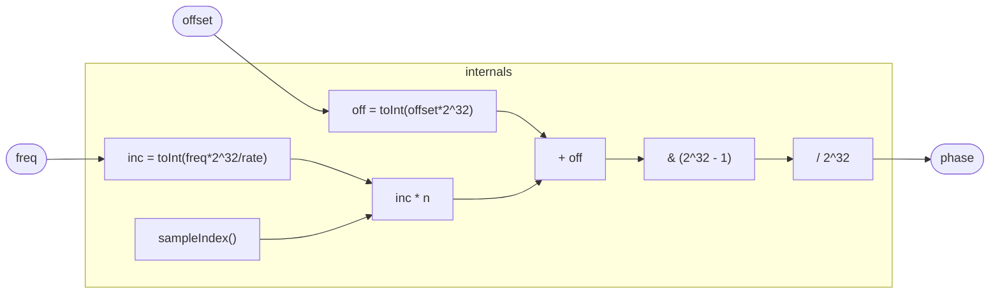

# FixedPhasor

A stateless, exact phase accumulator — the random-access twin of
`Phasor`. Instead of stepping a register each sample, it computes the
phase *directly* from the sample index in 32-bit fixed-point integer
arithmetic: `phase = ((inc · sampleIndex + offset) mod 2³²) / 2³²`.
Because the phase is a closed-form function of the sample index rather
than an accumulation, it is exact (no float drift over long runs),
random-access (evaluable at any sample, forward or backward), and the
wrap is a seamless integer overflow rather than a float modulo. The
phase lives on the circle ℤ/2³², which integer arithmetic represents
natively.

`inc` is the per-sample phase increment as an integer 32nd of a cycle,
`inc = toInt(freq · 2³² / sampleRate())`; `offset` is a phase offset in
cycles — a continuity-correction hook the control plane can set when
`freq` changes live. This form is exact for a *constant* `freq`: the
increment-times-index product *is* the phase. It is **not** a drop-in
under increment-rate FM — modulating `freq` here scales the unbounded
`sampleIndex`, the same blow-up `Phasor` avoids by accumulating; do
audio-rate modulation in the phase domain (add to `offset`) instead.

## Signal flow



## Internals

No registers — the whole program is a pure function of `sampleIndex()`,
`freq`, and `offset`. Each sample:

1. **`inc = toInt(freq · 2³² / sampleRate())`** — the per-sample phase
   step as an integer fraction of a cycle (a 32-bit phase word). At
   48 kHz and 440 Hz, `inc ≈ 39.37` million; a full cycle is
   `2³² / inc ≈ 109.1` samples, matching `Phasor`. Rounding `inc` to an
   integer quantizes the frequency to the grid `sampleRate / 2³²`
   (≈ 11 µHz at 48 kHz) — a fixed, inaudible detune, in exchange for a
   phase that never drifts.
2. **`acc = inc · sampleIndex() + off`** — the total phase at this
   sample, in 32-bit fixed-point. The `int` multiply and add wrap mod
   2⁶⁴; only the low 32 bits matter, and a wrapping multiply's low bits
   are exact no matter how many cycles have elapsed — so there is no
   large-argument precision loss, the failure mode of the float
   `sampleIndex · freq` form.
3. **`acc & 4294967295`** — mask to the low 32 bits, i.e. reduce mod
   2³². This *is* the phase wrap: the cycle boundary is integer
   overflow, exact and seamless, with no special case. The masked value
   is in `[0, 2³²)`, so its top bit is clear and the signed `toFloat`
   (the only int→float tropical emits) converts it correctly.
4. **`/ 4294967296`** — map `[0, 2³²)` onto the unipolar `[0, 1)` ramp.

`offset` is a phase offset in cycles, `off = toInt(offset · 2³²)`,
added before the wrap. With `offset = 0` this is a plain phasor. A live
`freq` change clicks unless the control plane also moves `offset` to
keep the phase continuous at the change instant
(`off += (inc_old − inc_new) · sampleIndex`) — the stateless continuity
correction. Because `offset` carries the full 32-bit phase exactly
through its `float` slot (2³² < 2⁵³), the correction is exact.

Everything is 32-bit. `inc`, `off`, and `acc`'s low word fit the
`int` (i64) temporaries exactly; the only values that cross a `double`
slot — `freq` and `offset` — are well under 2⁵³, so they round-trip
intact. Integer arithmetic is bit-identical across the JIT and wasm
backends (no float rounding), so the wrap is deterministic by
construction.

## Source

```tropical
program FixedPhasor(freq: freq = 440, offset: unipolar = 0) -> (phase: unipolar) {
  phase = let {
      inc: toInt(freq * 4294967296 / sampleRate());
      off: toInt(offset * 4294967296)
    } in let {
      acc: inc * sampleIndex() + off
    } in toFloat(acc & 4294967295) / 4294967296
}
```
