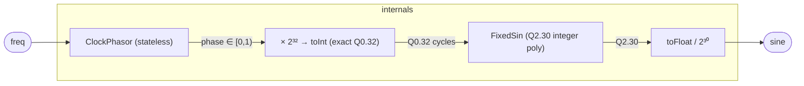

# FixedSinOsc

A sine oscillator built on `FixedPhasor` instead of `Phasor` — so it is
**fully stateless** (register-free) end to end. `FixedPhasor` computes
phase directly from the sample index in fixed-point, and `Sin` is a pure
polynomial, so the whole voice is a closed-form function of the sample
index with no accumulated state. That makes it **random-access**: it can
be evaluated at any sample index, forward or backward, and produces the
exact samples the audio thread does — which is precisely what a second
consumer (a scope, a video synth) needs to re-render a window of the
signal locked to playback. The trade vs. `SinOsc` (which carries
`Phasor`'s one register) is the same as `FixedPhasor` vs. `Phasor`:
exact and seekable, but increment-FM scales the unbounded sample index,
so modulate in the phase domain.

## Signal flow



## Internals

**ClockPhasor.** A register-free phasor: `phase = ((⌊freq·2³²/SR⌋ ·
sampleIndex) mod 2³²) / 2³²`, exact and drift-free on the circle ℤ/2³².
No accumulator, so the phase at sample *n* depends only on *n*.

**Phase re-landing.** `toInt(phase · 2³²)` recovers the phasor's raw
Q0.32 integer **exactly** (the phase is `P/2³²` with `P < 2³² ≪ 2⁵³`, so
the float round-trip is lossless) — the Q0.32-in-cycles argument
`FixedSin` expects. No radians, no float π.

**FixedSin polynomial.** The Q2.30 integer datapath sine
(`stdlib/FixedSin.md`): range reduction by masking/shifts, degree-15
Taylor Horner in i64. The sample value never exists in float until the
single `toFloat(out)/2³⁰` scale at the voice's boundary — the property
that lets an f32-native backend (Metal) evaluate this voice
byte-identically to the JIT (design/fixed-carrier.md).

Because no stage holds a register, `FixedSinOsc` carries **zero**
state. `FlatRuntime::render_window` can therefore evaluate it at any
sample-index window exactly, concurrently with the audio thread — the
basis of the scope / multi-rate-consumer path.

## Source

```tropical
program FixedSinOsc(freq: freq = 440, clk: clock = clock(), phase: unipolar = 0) -> (sine: float) {
  ph = ClockPhasor(clk: clk, freq: freq, offset: phase)
  sin = FixedSin(phase: toInt(ph.phase * 4294967296))
  sine = toFloat(sin.out) / 1073741824
}
```

`phase` exposes `ClockPhasor`'s stateless continuity-correction hook up to the
oscillator's signature: it adds a pure phase offset (independent of `freq`), so a
control plane can keep the phase continuous across a live `freq` change by bumping
`phase` by `(f₀−f₁)·τ` at the change. Default `0` emits identically to the
offset-less form.
