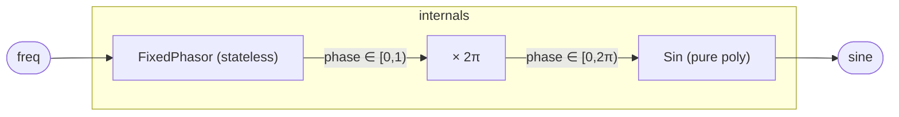

# FixedSinOsc

A sine oscillator built on `FixedPhasor` instead of `Phasor` — so it is
**fully stateless** (register-free) end to end. `FixedPhasor` computes
phase directly from the sample index in fixed-point, and `Sin` is a pure
polynomial, so the whole voice is a closed-form function of the sample
index with no accumulated state. That makes it **random-access**: it can
be evaluated at any sample index, forward or backward, and produces the
exact samples the audio thread does — which is precisely what a second
consumer (a scope, a video synth) needs to re-render a window of the
signal locked to playback. The trade vs. `SinOsc` (which carries
`Phasor`'s one register) is the same as `FixedPhasor` vs. `Phasor`:
exact and seekable, but increment-FM scales the unbounded sample index,
so modulate in the phase domain.

## Signal flow



## Internals

**FixedPhasor.** A register-free phasor: `phase = ((⌊freq·2³²/SR⌋ ·
sampleIndex) mod 2³²) / 2³²`, exact and drift-free on the circle ℤ/2³².
No accumulator, so the phase at sample *n* depends only on *n*.

**Phase scaling.** The [0, 1) phase is mapped to [0, 2π) by multiplying
by `6.283185307179586` (the float closest to 2π), the full-cycle
convention `Sin` expects.

**Sin polynomial.** `Sin` does Payne–Hanek range reduction and a
degree-11 Horner polynomial — pure combinational, no registers.

Because neither stage holds a register, `FixedSinOsc` carries **zero**
state. `FlatRuntime::render_window` can therefore evaluate it at any
sample-index window exactly, concurrently with the audio thread — the
basis of the scope / multi-rate-consumer path.

## Source

```tropical
program FixedSinOsc(freq: freq = 440, clk: clock = clock()) -> (sine: float) {
  ph = ClockPhasor(clk: clk, freq: freq)
  sin = Sin(x: 6.283185307179586 * ph.phase)
  sine = sin.out
}
```
