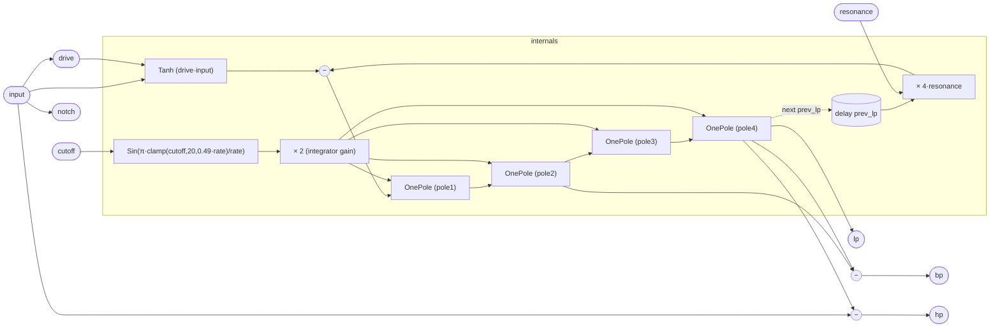

# LadderFilter

A four-pole ladder filter modelled after the Moog transistor-ladder topology.
Four identical one-pole integrator stages are chained, with the output of the
fourth stage fed back — negated and scaled by resonance — to the input of the
first. This feedback loop is what gives the ladder its characteristic
resonant peak and potential for self-oscillation.

Each stage is a `OnePole` instance (see `OnePole.md`), which folds `tanh`
saturation into its integrator. The input also passes through a `tanh` stage
(scaled by `drive`) before entering the first pole. Together these nonlinearities
give the filter a warm, progressive distortion character distinct from linear
ladder approximations.

## Signal flow



## Internals

**Gain coefficient.** The per-stage integrator gain is computed as:

```
g = 2 · sin(π · clamp(cutoff, 20, 0.49·rate) / rate)
```

The cutoff is first clamped to the range [20 Hz, 49% of Nyquist] before being
normalised to [0, 0.49π]. Taking the sine of this normalised frequency gives a
gain schedule that maps 0 Hz → 0 and Nyquist → ≈ 0; the factor of 2 scales the
range to suit `OnePole`'s integrator formula (`s += g · (tanh(in) − tanh(s))`).
This is a common simplified alternative to the exact bilinear-transform
coefficient `tan(π·f/rate)`.

**Input saturation.** `drive · input` is passed through `Tanh` before the first
pole. This pre-clipping stage softens transients and prevents the feedback loop
from receiving arbitrarily large input values, keeping the ladder stable under
heavy drive.

**Resonance feedback.** `prev_lp` is a unit-delay register initialised to zero,
holding the previous sample's `pole4.out`. Subtracting `4 · resonance · prev_lp`
from the tanh-clipped input closes the ladder's characteristic feedback loop.
The unit delay breaks the algebraic cycle that would otherwise exist (since
`pole4.out` depends on `pole1`'s input, which would depend on `pole4.out` in
the same sample). At `resonance = 1` the feedback factor is 4, which corresponds
to full self-oscillation in a linear analysis of the four-stage ladder.

**Four poles.** `pole1` through `pole4` are four `OnePole` instances in series,
each sharing the same gain `2 · sin_g.out`. Because each `OnePole` already
incorporates `tanh` on both input and state, the signal is progressively
saturated through all four stages.

**Output taps.**

- `lp = pole4.out` — fourth-pole lowpass, −24 dB/oct rolloff.
- `bp = pole2.out − pole4.out` — a bandpass approximation taken by
  differencing the second and fourth pole outputs.
- `hp = input − pole4.out` — a highpass approximation (dry signal minus the
  lowpass component).
- `notch = input − pole4.out + pole4.out` — this expression simplifies
  algebraically to `input`, which is almost certainly unintentional. A correct
  notch would be `hp + lp` = `input − pole4.out + pole4.out` only if the signs
  are rearranged to produce `input − 2·bp` or a similar combination. This
  appears to be a placeholder or bug in the current source.

## Source

```tropical
program LadderFilter(input = 0, cutoff: freq = 1000, resonance: unipolar = 0.5, drive = 1) -> (lp, bp, hp, notch) {
  delay prev_lp = pole4.out init 0
  tanh_in = Tanh(x: drive * input)
  sin_g = Sin(x: 3.141592653589793 * (clamp(cutoff, 20, 0.49 * sampleRate()) / sampleRate()))
  pole1 = OnePole(input: tanh_in.out - 4 * resonance * prev_lp, g: 2 * sin_g.out)
  pole2 = OnePole(input: pole1.out, g: 2 * sin_g.out)
  pole3 = OnePole(input: pole2.out, g: 2 * sin_g.out)
  pole4 = OnePole(input: pole3.out, g: 2 * sin_g.out)
  lp = pole4.out
  bp = pole2.out - pole4.out
  hp = input - pole4.out
  notch = input - pole4.out + pole4.out
}
```
