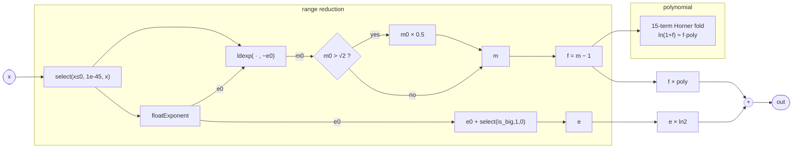

# Log

Computes `ln(x)` for positive `x` using the classic floating-point
logarithm recipe: extract the binary exponent, range-reduce the mantissa
into a neighbourhood of 1, evaluate a 15th-degree Taylor polynomial for
`ln(1 + f)`, then recombine the two contributions.

Non-positive inputs are silently forwarded as `1e-45` (the smallest
representable positive `float`), which returns roughly −103.97 rather than
−∞ or NaN. This keeps the kernel free of branches on the audio path and
avoids IEEE exceptional values propagating downstream.

## Signal flow



## Internals

### Range reduction

`floatExponent(x)` reads the biased exponent field of the IEEE 754
representation and returns the unbiased integer exponent `e0`, so
`x = m0 · 2^e0` with `m0 ∈ [1, 2)`.

The mantissa is further bisected at `√2 ≈ 1.414`:

- If `m0 > √2`, increment the logical exponent by 1 and halve the
  mantissa, mapping `m` into `[√2/2, √2) ≈ [0.707, 1.414)`.
- Otherwise keep `m = m0 ∈ [1, √2)`.

Either way `m` is centred on 1, so `f = m − 1 ∈ (−0.293, 0.414)`.
This half-interval is tight enough that a 15-term Taylor series converges
with sub-ULP error across the range.

### Polynomial evaluation

The `fold` evaluates the Horner form of the Taylor series for `ln(1 + f)`:

```
ln(1 + f) = f − f²/2 + f³/3 − f⁴/4 + … + f¹⁵/15
           = f · (1 − f/2 + f²/3 − … + f¹⁴/15)
```

The coefficient list `[1/15, −1/14, 1/13, …, −1/2, 1]` is the alternating
reciprocal sequence in ascending degree order. The accumulator
`(a, c) => c + a * f` implements one Horner step: `acc ← c + acc·f`.
Starting from 0 and iterating left-to-right this builds the inner factor
of the polynomial, leaving `poly = 1 − f/2 + f²/3 − …`. The final result
multiplies by `f` (`f * poly`) to restore the leading factor.

### Recombination

`ln(x) = ln(m · 2^e) = ln(m) + e · ln(2)`

`ln(m) ≈ f · poly` from the polynomial step. The constant
`0.6931471805599453` is `ln(2)` to double precision. The two terms are
added to yield `ln(x)`.

This program has no state and no side-effects; it is a pure combinational
scalar computation that lowers to a compact sequence of arithmetic and
bit-manipulation ops in the kernel.

## Source

```tropical
program Log(x: float = 1) -> (out: float) {
  out = let { safe_x: select(x <= 0, 1e-45, x); e0: floatExponent(safe_x); m0: ldexp(safe_x, -e0); is_big: m0 > 1.4142135623730951; e: e0 + select(is_big, 1, 0); m: select(is_big, m0 * 0.5, m0); f: m - 1; poly: fold([0.06666666666666667, -0.07142857142857142, 0.07692307692307693, -0.08333333333333333, 0.09090909090909091, -0.1, 0.1111111111111111, -0.125, 0.14285714285714285, -0.16666666666666666, 0.2, -0.25, 0.3333333333333333, -0.5, 1], 0, (a, c) => c + a * f) } in f * poly + e * 0.6931471805599453
}
```
