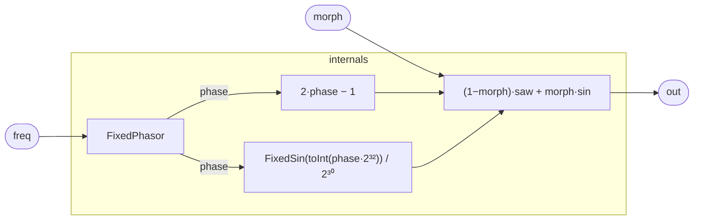

# MorphOsc

A stateless oscillator that crossfades continuously between a sawtooth and a
sine, both derived from the **same** `FixedPhasor` so they stay phase-aligned.
`morph = 0` is a pure ramp saw (`2·phase − 1`), `morph = 1` is a pure sine, and
in between it's the linear blend `(1−morph)·saw + morph·sin`. Because every
stage is register-free (`FixedPhasor` + `FixedSin` + arithmetic), the whole voice
carries zero state and is random-access — `render_window` can evaluate any
sample-index window exactly, so a scope can show it morphing live, locked to
playback. The saw is the naive (non-band-limited) ramp; for a clean scope demo
that's the point — you see the shape, not an anti-aliased approximation.

## Signal flow



## Internals

One `FixedPhasor` drives both shapes, so saw and sine share a phase and the
crossfade has no beating. The saw is `2·phase − 1` (a ramp in [−1, 1)); the sine
is the Q2.30 integer datapath (`FixedSin` at the exactly re-landed Q0.32 phase —
see `FixedSinOsc` for why the round-trip is lossless), scaled to float once at
the blend. `morph` (a unipolar control, typically driven by a param or an LFO)
linearly blends them: `out = (1−morph)·saw + morph·sin`.

No registers anywhere — drive `morph` from a `param` slot and a controller (or
the scope) can sweep it live while `render_window` reads the exact resulting
waveform.

## Source

```tropical
program MorphOsc(freq: freq = 220, morph: unipolar = 0, clk: clock = clock(), phase: unipolar = 0) -> (out: float) {
  ph = ClockPhasor(clk: clk, freq: freq, offset: phase)
  sin = FixedSin(phase: toInt(ph.phase * 4294967296))
  out = (1 - morph) * (2 * ph.phase - 1) + morph * (toFloat(sin.out) / 1073741824)
}
```

`phase` is the phasor's stateless continuity-correction offset (see `FixedSinOsc`):
it lets a control plane keep the phase continuous across a live `freq` change by
bumping it `(f₀−f₁)·τ`. Default `0` emits identically to the offset-less form.
