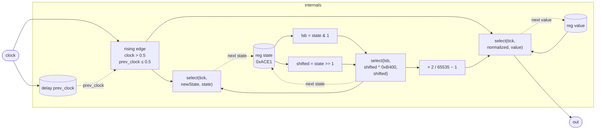

# NoiseLFSR

A clocked 16-bit Galois LFSR noise source. On each rising edge of `clock`
the register advances one step and the output snaps to a new
pseudo-random level, held until the next tick. Between ticks the output
is perfectly static — no interpolation, no anti-aliasing — making it
suitable as the noise source in sample-and-hold circuits, stepped
random modulation (S&H LFO), and clocked randomness generators where
the clock rate is well below Nyquist.

The sequence has maximum period 2^16 − 1 = 65 535 steps before repeating.
At audio-rate clocking (one advance per sample) the full cycle lasts about
1.4 seconds at 48 kHz.

## Signal flow



## Internals

Three registers carry all the state:

**`state` (16-bit Galois LFSR, seed 0xACE1).**  
Each tick, the current LSB is extracted (`lsb = state & 1`), the
register is shifted right by one (`shifted = state >> 1`), and if the
outgoing bit was 1 the feedback mask 0xB400 is XOR-ed into the
shifted value; if it was 0 the shifted value is used as-is. This is
the standard Galois (one-step parallel) form of the maximal-length
16-bit LFSR with characteristic polynomial
x^16 + x^14 + x^13 + x^11 + 1 (tap bits 15, 13, 12, 10 of the
shifted result, counting from 0 — which is exactly the bits set in
0xB400). With a nonzero seed the sequence visits all 65 535 nonzero
states before repeating.

The seed 44257 = 0xACE1 is an arbitrary nonzero initial state; any
nonzero 16-bit value produces a maximal sequence.

**`value` (output hold).**  
The normalized LFSR output (`newState * 2 / 65535 − 1`, mapping the
integer range [0, 65535] to approximately [−1, +1]) is only written
into `value` on a tick; between ticks `value` is returned unchanged.
This is the sample-and-hold behaviour: the output steps on clock
edges and is constant otherwise.

**`prev_clock` (unit delay for edge detection).**  
`delay prev_clock = clock init 0` is a one-sample delay. The rising
edge condition `tick = (clock > 0.5) * (prev_clock <= 0.5)` is 1
exactly on the first sample where `clock` crosses above 0.5. Using
multiplication instead of a boolean AND keeps the expression in the
scalar arithmetic that the kernel compiler lowers without branching.

The normalization divisor 65535 (= 2^16 − 1) is the LFSR period and
also the maximum integer value reachable by a 16-bit register. The
factor of 2 and the −1 shift the range from [0, 1] to [−1, +1].
Because the LFSR never reaches 65535 (that would be the all-ones
state, which the feedback equation can produce but the state sequence
passes through as an intermediate on its way to something else),
the true peak is `65534 * 2 / 65535 − 1 ≈ 0.99997` — effectively
full-scale bipolar.

## Source

```tropical
program NoiseLFSR(clock = 0) -> (out: signal) {
  reg state: int = 44257
  reg value = 0
  delay prev_clock = clock init 0
  out = let { tick: (clock > 0.5) * (prev_clock <= 0.5); lsb: state & 1; shifted: state >> 1 } in let { newState: select(lsb, shifted ^ 46080, shifted); normalized: select(lsb, shifted ^ 46080, shifted) * 2 / 65535 - 1 } in select(tick, normalized, value)
  next state = let { tick: (clock > 0.5) * (prev_clock <= 0.5); lsb: state & 1; shifted: state >> 1 } in let { newState: select(lsb, shifted ^ 46080, shifted) } in select(tick, newState, state)
  next value = let { tick: (clock > 0.5) * (prev_clock <= 0.5); lsb: state & 1; shifted: state >> 1 } in let { newState: select(lsb, shifted ^ 46080, shifted); normalized: select(lsb, shifted ^ 46080, shifted) * 2 / 65535 - 1 } in select(tick, normalized, value)
}
```
