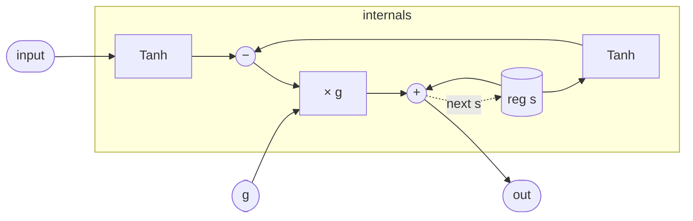

# OnePole

A one-pole lowpass with a nonlinearity folded into the integrator loop.
Instead of accumulating the raw difference between input and state — the
textbook `s += g·(input − s)` — both the input *and* the state pass
through `tanh` before the difference is taken. At small amplitudes
`tanh(x) ≈ x` and this collapses to the textbook linear smoother. Driven
hard, the saturated difference bounds how fast the state can move, so
the filter slews rather than tracks: the same topology serves as a
parameter smoother, a gentle 6 dB/oct tone control, and one stage of a
saturated ladder.

## Signal flow



## Internals

One register, `s`, is the entire filter. Each sample:

1. `Tanh(input)` and `Tanh(s)` saturate the input and the current state
   independently (`tanh_in`, `tanh_s`).
2. Their difference, scaled by `g`, is the increment — the saturated
   error signal driving the state toward the input.
3. `next s` writes the incremented state back; `out` is that same
   expression, so the output is the *post*-update state (no extra
   sample of latency between state and output).

The saturation on the state path (not just the input) is what makes the
loop self-limiting: as `s` grows, `tanh(s)` compresses, the error term
shrinks, and the state converges smoothly instead of overshooting.
`Tanh` itself is the stdlib's polynomial approximation — see
`Tanh.md` — so the whole filter lowers to a handful of scalar ops with
no transcendental calls in the kernel.

## Source

```tropical
program OnePole(input: signal = 0, g: float = 0.1) -> (out: signal) {
  reg s = 0
  tanh_in = Tanh(x: input)
  tanh_s = Tanh(x: s)
  out = s + g * (tanh_in.out - tanh_s.out)
  next s = s + g * (tanh_in.out - tanh_s.out)
}
```
