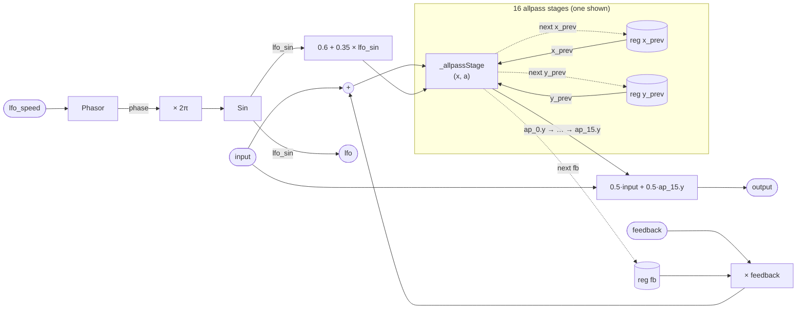

# Phaser16

A 16-stage phaser built from first-order allpass sections. Each stage is a
classical allpass filter whose coefficient is continuously swept by a
sinusoidal LFO. Cascading 16 stages creates 16 phase notches (and peaks,
depending on mix) spread across the audio band. The global feedback register
wraps a delayed copy of the final stage's output back to the cascade input,
which sharpens and resonates the notch pattern.

The architecture is an unrolled, instance-per-stage version of the generic
`Phaser<N>` program. Where `Phaser` uses array registers and `scan` to
express N stages generically, `Phaser16` spells out each stage explicitly as
a named `_allpassStage` instance, which lets the compiler fuse them as 16
inlined sub-kernels in a single pass rather than unrolling an array loop.

## Signal flow



## Internals

### Allpass stage

Each of the 16 identical `_allpassStage` sub-programs implements the
difference equation:

```
y[n] = −a · x[n] + x[n−1] + a · y[n−1]
```

This is a first-order allpass filter with coefficient `a`. It has unity
gain at all frequencies — amplitude is unchanged — but the phase response
varies with frequency, rotating by 0° at DC and by 180° at Nyquist for
any `a ∈ (0, 1)`. The phase crossover (90°) occurs at the frequency where
`cos(ω) = −a`, so sweeping `a` sweeps the crossover frequency. When 16
stages are cascaded, 16 such crossovers combine into a rich comb of phase
shifts that adds constructively and destructively with the dry signal to
produce notches and peaks across the spectrum.

Inside `_allpassStage`, two registers (`x_prev`, `y_prev`) store the
previous input and previous output respectively. The writeback expression
for `y_prev` is the same formula as `y` — it is re-evaluated rather than
aliased, which is equivalent because the expression is pure and both `y`
and `next y_prev` read the same `x_prev` and `y_prev` from the same
sample boundary.

### LFO and coefficient modulation

`Phasor` accumulates phase at `lfo_speed` Hz, wrapping at 1. That phase is
scaled by 2π (`6.283185307179586`) and passed to `Sin`, which uses a
minimax polynomial to evaluate the sine without a transcendental call in
the kernel. The result, `lfo_sin.out ∈ [−1, 1]`, drives:

```
a = 0.6 + 0.35 · lfo_sin.out   →   a ∈ [0.25, 0.95]
```

All 16 stages share the identical `a` each sample — a broadcast modulation.
As `a` sweeps between 0.25 and 0.95, the allpass crossover frequency sweeps
across a wide band, moving all 16 notches together. The overall sweep range
covers roughly a decade of frequency.

### Global feedback

`reg fb` holds the previous sample's cascade output (`ap_15.y`). At the
start of each sample, the cascade input is `input + feedback * fb`. This
wraps the 16-stage cascade in a one-pole feedback loop (one sample of delay
supplied by the register). Positive `feedback` values (the default is 0.4)
feed energy back into the cascade, sharpening and resonating the notch
pattern. Values approaching 1.0 can cause instability because the loop gain
at notch frequencies approaches unity — use with care, especially with slow
LFO rates where `a` stays close to 0.95.

### Output

The output is an equal-power dry/wet blend at fixed 50/50 ratio:
`0.5 * input + 0.5 * ap_15.y`. The dry component is necessary for the
allpass cascade to produce audible notches: an allpass alone passes all
frequencies at unity gain, so without mixing in the dry signal no
cancellation occurs. The 50/50 split produces the deepest notches (full
cancellation at crossover frequencies where the allpass contributes a
180° phase shift).

## Source

```tropical
program Phaser16(input = 0, feedback = 0.4, lfo_speed = 0.2) -> (output, lfo) {
  reg fb = 0
  program _allpassStage(x, a) -> (y) {
    reg x_prev = 0
    reg y_prev = 0
    y = -a * x + x_prev + a * y_prev
    next x_prev = x
    next y_prev = -a * x + x_prev + a * y_prev
  }
  lfo_ph = Phasor(freq: lfo_speed)
  lfo_sin = Sin(x: 6.283185307179586 * lfo_ph.phase)
  ap_0 = _allpassStage(x: input + feedback * fb, a: 0.6 + 0.35 * lfo_sin.out)
  ap_1 = _allpassStage(x: ap_0.y, a: 0.6 + 0.35 * lfo_sin.out)
  ap_2 = _allpassStage(x: ap_1.y, a: 0.6 + 0.35 * lfo_sin.out)
  ap_3 = _allpassStage(x: ap_2.y, a: 0.6 + 0.35 * lfo_sin.out)
  ap_4 = _allpassStage(x: ap_3.y, a: 0.6 + 0.35 * lfo_sin.out)
  ap_5 = _allpassStage(x: ap_4.y, a: 0.6 + 0.35 * lfo_sin.out)
  ap_6 = _allpassStage(x: ap_5.y, a: 0.6 + 0.35 * lfo_sin.out)
  ap_7 = _allpassStage(x: ap_6.y, a: 0.6 + 0.35 * lfo_sin.out)
  ap_8 = _allpassStage(x: ap_7.y, a: 0.6 + 0.35 * lfo_sin.out)
  ap_9 = _allpassStage(x: ap_8.y, a: 0.6 + 0.35 * lfo_sin.out)
  ap_10 = _allpassStage(x: ap_9.y, a: 0.6 + 0.35 * lfo_sin.out)
  ap_11 = _allpassStage(x: ap_10.y, a: 0.6 + 0.35 * lfo_sin.out)
  ap_12 = _allpassStage(x: ap_11.y, a: 0.6 + 0.35 * lfo_sin.out)
  ap_13 = _allpassStage(x: ap_12.y, a: 0.6 + 0.35 * lfo_sin.out)
  ap_14 = _allpassStage(x: ap_13.y, a: 0.6 + 0.35 * lfo_sin.out)
  ap_15 = _allpassStage(x: ap_14.y, a: 0.6 + 0.35 * lfo_sin.out)
  output = 0.5 * input + 0.5 * ap_15.y
  lfo = lfo_sin.out
  next fb = ap_15.y
}
```
