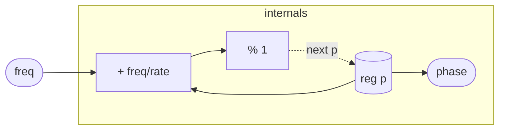

# Phasor

A phase accumulator — the minimal building block for any periodic
signal. Each sample the register `p` advances by `freq / rate` and
wraps modulo 1, producing a rising sawtooth ramp in [0, 1). The
output is the *pre-increment* value of `p`, so on the first sample
the phase is exactly 0 and one full cycle of `N` samples spans
phases 0, 1/N, 2/N, …, (N−1)/N before wrapping.

Phasor is not an oscillator by itself — it is the shared "clock"
that all waveshape modules plug into. Pass its `phase` output into
`Sin`, `Cos`, `Pulse`, or any lookup table; that separation keeps
waveshaping orthogonal to pitch tracking and lets multiple
oscillators share or offset a single phase source.

## Signal flow



## Internals

One register, `p`, is the entire accumulator. Each sample:

1. `phase = p` — the current (pre-update) phase is exposed as the
   output. This zero-latency read means downstream modules see the
   same phase that drives the current sample's waveshaping.
2. `next p = (p + freq / sampleRate()) % 1` — the accumulator steps
   forward by `freq / rate` (the normalized per-sample increment) and
   wraps at 1. The modulo keeps the phase strictly in [0, 1) regardless
   of how many cycles have elapsed.

`sampleRate()` is a built-in runtime source; it reflects the actual
device rate at compile time so no external `rate` input is needed.
At 48000 Hz and 440 Hz, the increment is 440/48000 ≈ 0.009167 — the
accumulator completes one wrap every 48000/440 ≈ 109.1 samples.

Wrapping at 1 rather than 2π is a deliberate normalization choice: it
keeps the phase domain tightly bounded and lets sine/cosine lookup
tables or polynomial approximations work over a [0, 1) domain with
one multiplication (× 2π) deferred to the consumer, rather than
embedding a 2π factor in every phasor instance.

## Source

```tropical
program Phasor(freq: freq = 440) -> (phase: unipolar) {
  reg p = 0
  phase = p
  next p = (p + freq / sampleRate()) % 1
}
```
