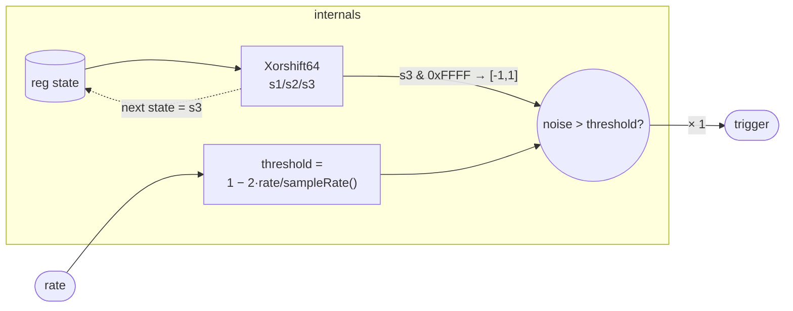

# PoissonEvent

Produces a stream of irregular trigger pulses whose long-run firing rate
equals `rate` events per second. Each sample, a Xorshift64 generator
advances one step and its low 16 bits are compared against a threshold
derived from `rate / sampleRate()`. Because the PRNG output is
statistically uniform over its range, the comparison acts as a Bernoulli
trial: the probability that any given sample fires is exactly
`rate / sampleRate()`, so over one second the expected count equals
`rate`. This is the defining property of a Poisson process at the
per-sample granularity.

The output is a gate-style trigger: 1 on a firing sample, 0 otherwise.
It can feed an envelope, a sample-and-hold, or any event-driven stage
that expects a ≥0 trigger signal.

## Signal flow



## Internals

The generator is a Xorshift64 — one of the simplest full-period
non-linear feedback shift registers. Three xor-shift operations advance
the 64-bit word:

```
s1 = state ^ (state << 13)
s2 = s1    ^ (s1    >>  7)
s3 = s2    ^ (s2    << 17)
```

The shift triple (13, 7, 17) is a standard Xorshift64 triplet chosen to
maximize the period (2⁶⁴ − 1, all nonzero states visited exactly once)
while keeping the avalanche properties that make low-bit extractions
well-distributed. `next state` saves `s3` so the sequence advances by
one step per sample.

**Noise extraction.** The trigger expression also computes `s3` (as a
separate `let`-chain, so the computation is shared by the elaborator)
and extracts the low 16 bits:

```
noise = (s3 & 65535) * 2 / 65535 - 1
```

This maps an integer in [0, 65535] to a float in [−1, 1]. The mapping
is nearly uniform because the low 16 bits of a Xorshift64 pass standard
uniformity tests.

**Threshold.** The Poisson rate condition requires that each sample fires
independently with probability p = `rate / sampleRate()`. For a uniform
variate U ∈ [−1, 1], P(U > t) = (1 − t) / 2. Setting (1 − t) / 2 = p
gives:

```
threshold = 1 − 2 · rate / sampleRate()
```

The comparison `(noise > threshold) * 1` then fires with that probability
on each sample. Over a one-second window the expected number of firings
equals `rate`, matching a Poisson process in the limit.

**Seed.** The initial `state` is `2685821657736339000`
(≈ 0x2545F4914F6CDD1D), the Knuth multiplicative hash constant derived
from the golden ratio (2⁶⁴ / φ). This is a standard non-degenerate seed
for Xorshift generators; it is far from zero and spreads the low bits of
any starting sequence.

**Corner cases.** `rate = 0` sets `threshold = 1`, and since `noise ≤ 1`
the comparison is never true — the output is silent. Very large `rate`
(approaching `sampleRate() / 2`) sets `threshold` near −1, so almost
every sample fires; above `sampleRate()` the threshold goes below −1 and
the output is constant 1. There is no explicit clamping — callers are
expected to keep `rate` in [0, sampleRate()].

## Source

```tropical
program PoissonEvent(rate: float = 4) -> (trigger: signal) {
  reg state: int = 2685821657736339000
  trigger = let { s1: state ^ state << 13 } in let { s2: s1 ^ s1 >> 7 } in let { s3: s2 ^ s2 << 17 } in let { noise: (s3 & 65535) * 2 / 65535 - 1; threshold: 1 - 2 * rate / sampleRate() } in (noise > threshold) * 1
  next state = let { s1: state ^ state << 13 } in let { s2: s1 ^ s1 >> 7 } in s2 ^ s2 << 17
}
```
