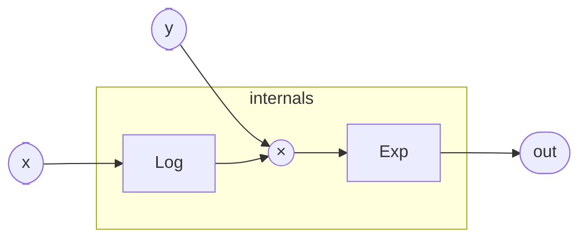

# Pow

Computes `x^y` for a positive base `x` and an arbitrary real exponent `y`
using the identity `x^y = e^(y·ln x)`. The two-step decomposition
(logarithm then scaled exponential) handles the full range of real
exponents — including fractional roots, negative exponents, and
non-integer powers — using only the polynomial approximations already
present in `Log` and `Exp`.

Because `Log` guards against non-positive inputs by clamping `x ≤ 0` to
approximately `1e-45`, `Pow` never produces a NaN or raises a domain
error; the result for `x ≤ 0` is a very large negative number passed
through `Exp`, which in turn clamps its input to `[-87, 88]` before
evaluation. Callers that can guarantee `x > 0` get exact power-law
scaling; callers that cannot should be aware that the guard substitution
changes the mathematical result near zero.

Common audio uses: exponential frequency mapping (`freq_base^v` to
convert a voltage-per-octave control to Hz), waveshaping exponents,
and amplitude scaling with arbitrary curvature.

## Signal flow



## Internals

The program is purely combinatorial — no registers, no feedback.

1. `log_x = Log(x: x)` computes `ln(x)` via a 15-term minimax
   polynomial on the mantissa of `x` after extracting the IEEE 754
   exponent. The exponent contribution is folded back as `e·ln 2`
   (≈ `e·0.6931…`), giving full double-precision range.

2. `y * log_x.out` scales the natural log by the exponent `y`. This
   is exact floating-point multiplication — no approximation at this
   step.

3. `exp = Exp(x: y * log_x.out)` evaluates `e^(y·ln x)`. `Exp` first
   clamps its argument to `[-87, 88]` (the range where a 64-bit float
   doesn't under/overflow), reduces the argument to a remainder `r`
   relative to the nearest integer multiple of `ln 2`, then evaluates
   a 6-term minimax polynomial for `e^r` and reconstructs the full
   result with `ldexp(exp_r, n)` — a free exponent-field write.

The two polynomial evaluations are the entire computational cost; the
multiplication in step 2 is fused into the `Exp` argument.

## Source

```tropical
program Pow(x: float = 1, y: float = 1) -> (out: float) {
  log_x = Log(x: x)
  exp = Exp(x: y * log_x.out)
  out = exp.out
}
```
