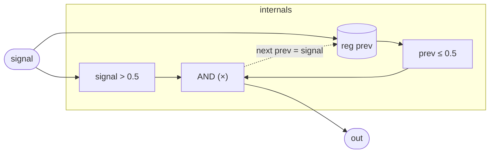

# Pulse

A one-sample-wide rising-edge detector. Given a signal that sits in the
gate convention (`0` = off, `1` = on), `Pulse` fires a single-sample
true pulse at the instant the signal first crosses above 0.5 — not for
every sample the signal is high, just the first one. This is the
standard way to convert a sustained gate into a momentary trigger:
clocks, envelopes, sequencer advances, and similar event-driven logic
all expect a trigger rather than a held-high gate.

The threshold is fixed at 0.5. For a clean binary gate the exact value
is irrelevant, but for a continuous signal (say, a sine LFO) the 0.5
crossing point determines when in the cycle the trigger fires.

## Signal flow



## Internals

One register, `prev`, holds the input from the previous sample. Each
sample:

1. `signal > 0.5` checks whether the signal is currently high.
2. `prev <= 0.5` checks whether it was low last sample.
3. Both conditions are multiplied together (boolean AND via scalar
   multiplication): the result is `1` only when both are true — i.e.,
   this is the first sample the signal is above threshold after a
   period at or below it.
4. `next prev = signal` advances the memory register so the crossing
   condition is correctly evaluated on the following sample.

The output is exactly one sample wide regardless of how long `signal`
stays high. Once `prev` has been written with a value above 0.5, the
`prev <= 0.5` condition is false for all subsequent high samples, so
`out` returns to `false` until the signal dips below 0.5 and rises
again.

The `bool` output type is a clamped scalar: `0` or `1`. The
multiplication is the idiomatic tropical form of a two-input boolean
AND — both factors are `{0, 1}`-valued, so their product is `1` iff
both are `1`.

## Source

```tropical
program Pulse(signal: signal = 0) -> (out: bool) {
  reg prev: float = 0
  out = (signal > 0.5) * (prev <= 0.5)
  next prev = signal
}
```
