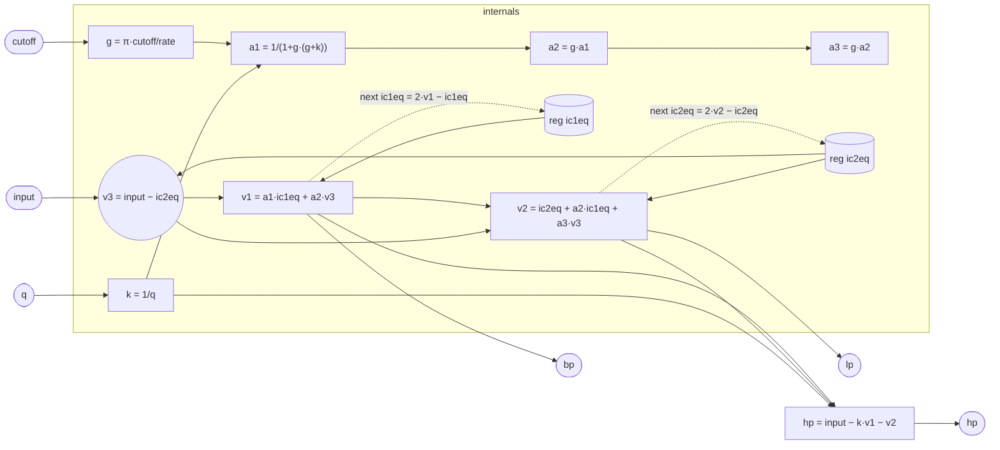

# SVF

A second-order state-variable filter using the zero-delay-feedback (ZDF)
topology described by Andrew Simper (Cytomic). Classic analogue SVF
implementations compute all three outputs from two integrators in a
feedback loop, but they suffer from a one-sample loop delay that causes
the resonant frequency to warp at high cutoffs. The ZDF version eliminates
that delay by solving the implicit system algebraically at each sample,
yielding accurate response up to half the Nyquist limit without
oversampling.

All three outputs — lowpass, bandpass, highpass — are computed from the
same pair of integrator states in a single pass. The topology is linear
and incurs no per-sample transcendental calls: the frequency-to-gain
mapping `g = π·cutoff/rate` is the only non-trivial formula, and it
evaluates to a scalar multiply after the division.

## Signal flow



## Internals

**Integrator gain.** The constant `3.141592653589793` is π. The gain
`g = π·cutoff/rate` is the bilinear-transform prewarped integrator gain
for the analogue prototype. At low frequencies `g ≈ ω₀T/2`; the
prewarping ensures the digital cutoff lands exactly at the specified
frequency (not just approximately).

**Damping.** `k = 1/q` is the feedback damping coefficient. At `q =
0.707` (`k ≈ 1.414`) the filter is critically damped (Butterworth). As
`q` increases beyond ~1, resonance builds at the cutoff; above `q ≈ 1/(2·g)`
the filter can self-oscillate (the exact limit is `k < 2`, i.e. `q > 0.5`).

**ZDF normalization.** The factor `a1 = 1/(1 + g·(g + k))` absorbs the
implicit feedback in one scalar reciprocal. It is the inverse of the
characteristic polynomial evaluated on the unit circle:
`1 + g·k + g²`. From `a1` the derived coefficients are:
- `a2 = g·a1`
- `a3 = g²·a1`

**Intermediate nodes per sample.**
- `v3 = input − ic2eq` — feeds the current input through the loop,
  subtracting the previous LP state to form the pre-HP node.
- `v1 = a1·ic1eq + a2·v3` — the bandpass output.
- `v2 = ic2eq + a2·ic1eq + a3·v3` — the lowpass output.
- `hp = input − k·v1 − v2` — highpass by Kirchhoff: input = lp + k·bp + hp,
  so hp = input − k·bp − lp.

**State writebacks.** The trapezoidal integrator update rule is
`ic_next = 2·v − ic_old`, derived from the bilinear transform relation
`v = (ic_next + ic_old)/2`. Both registers are written back each sample
using the same pattern, ensuring the filter is free of the half-sample
loop delay that afflicts the Euler (forward-difference) form.

The code recomputes `g`, `k`, and `a1`/`a2`/`a3` independently for each
output and writeback expression. This redundancy is an artefact of the
flat `let`-expression encoding: the strata pipeline and JIT share-eliminate
common subexpressions across the kernel, so there is no runtime cost.

## Source

```tropical
program SVF(input: signal = 0, cutoff: freq = 1000, q: float = 0.707) -> (lp: signal, bp: signal, hp: signal) {
  reg ic1eq = 0
  reg ic2eq = 0
  lp = let { g: 3.141592653589793 * cutoff / sampleRate(); k: 1 / q } in let { a1: 1 / (1 + g * (g + k)) } in let { a2: g * a1 } in let { a3: g * a2; v3: input - ic2eq } in let { v1: a1 * ic1eq + a2 * v3 } in ic2eq + (a2 * ic1eq + a3 * v3)
  bp = let { g: 3.141592653589793 * cutoff / sampleRate(); k: 1 / q } in let { a1: 1 / (1 + g * (g + k)) } in let { a2: g * a1; v3: input - ic2eq } in a1 * ic1eq + a2 * v3
  hp = let { g: 3.141592653589793 * cutoff / sampleRate(); k: 1 / q } in let { a1: 1 / (1 + g * (g + k)) } in let { a2: g * a1; a3: g * (g * a1); v3: input - ic2eq } in let { v1: a1 * ic1eq + a2 * v3; v2: ic2eq + (a2 * ic1eq + a3 * v3) } in input - k * v1 - v2
  next ic1eq = let { g: 3.141592653589793 * cutoff / sampleRate(); k: 1 / q } in let { a1: 1 / (1 + g * (g + k)) } in let { a2: g * a1; v3: input - ic2eq } in let { v1: a1 * ic1eq + a2 * v3 } in 2 * v1 - ic1eq
  next ic2eq = let { g: 3.141592653589793 * cutoff / sampleRate(); k: 1 / q } in let { a1: 1 / (1 + g * (g + k)) } in let { a2: g * a1; a3: g * (g * a1); v3: input - ic2eq } in let { v2: ic2eq + (a2 * ic1eq + a3 * v3) } in 2 * v2 - ic2eq
}
```
