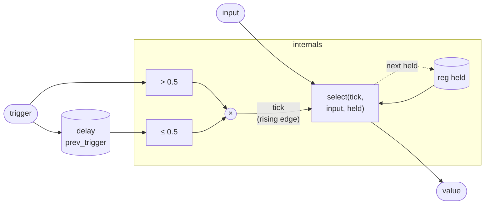

# SampleHold

A sample-and-hold that captures its input on each **rising edge** of a trigger
signal and holds the captured value until the next edge. The trigger threshold
is 0.5, and only a low-to-high transition fires — holding the trigger high does
not continuously re-capture.

The canonical use is pairing a clock or gate with a noise or CV source: the
clock fires periodically, the S&H freezes a snapshot of whatever the source
happens to be at that instant, and the result steps through discrete values at
the clock rate — a staircase random sequence, quantized note selection, or
stepped modulation source.

## Signal flow



## Internals

Two state elements cooperate to detect a rising edge without any branch
instructions in the kernel:

**`delay prev_trigger`** is a unit-delay register seeded at 0. Each sample it
holds the trigger value from the *previous* sample, making the detection window
exactly one sample wide.

**Rising-edge detection** is expressed as arithmetic: `(trigger > 0.5) *
(prev_trigger <= 0.5)`. Each comparison returns 1.0 or 0.0, and the product is
1.0 only when the current sample is above the threshold *and* the previous
sample was at or below it. This is the local binding `tick` — true for exactly
one sample per edge.

**`select(tick, input, held)`** picks `input` when `tick` is nonzero and `held`
otherwise. Both `value` and `next held` evaluate the same expression, so the
output is updated in the same sample the edge is detected (no extra latency),
and the register is updated in lock-step — no inconsistency between the visible
output and the latched state.

Because `tick` is strictly zero during a sustained high trigger level, the hold
is stable: re-triggering requires the trigger to go low again first. The
threshold of 0.5 sits midway in `[0, 1]` and works cleanly with both unipolar
gate signals (0/1) and bipolar triggers normalized to ±1.

## Source

```tropical
program SampleHold(trigger: signal = 0, input: signal = 0) -> (value: signal) {
  reg held = 0
  delay prev_trigger = trigger init 0
  value = let { tick: (trigger > 0.5) * (prev_trigger <= 0.5) } in select(tick, input, held)
  next held = let { tick: (trigger > 0.5) * (prev_trigger <= 0.5) } in select(tick, input, held)
}
```
