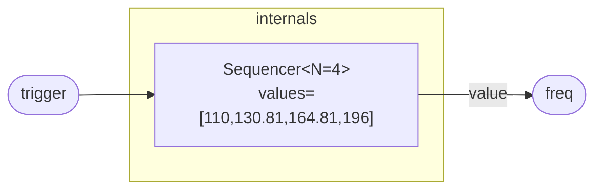

# Seq4MinorTranspose

A four-step sequencer locked to the pitches of an A minor seventh chord.
On each rising edge of `trigger` the sequencer walks to the next pitch in
the voicing — A2 (110 Hz), C3 (130.81 Hz), E3 (164.81 Hz), G3 (196 Hz) —
and wraps back to A2 after the fourth step. The name "MinorTranspose"
reflects the minor-seventh stacking: the intervals are a minor third, a
major third, and another minor third, the four notes of Am7 laid out one
per step.

The program is a thin wrapper around the generic `Sequencer<N>` with `N`
fixed to 4 and the `values` array pre-filled. Feed it any unipolar clock
(a `Clock` module, a trigger envelope, a MIDI gate) and route `freq`
directly to an oscillator's pitch input.

## Signal flow



## Internals

The program delegates entirely to `Sequencer<N=4>`. Inside that instance:

- `reg step: int = 0` tracks the current position in the four-element
  values array.
- `delay prev_clock` holds the clock value from the previous sample so
  that rising-edge detection (`clock > 0.5` and `prev_clock <= 0.5`) is
  unambiguous regardless of how long the trigger stays high.
- On each rising edge `step` increments by 1 modulo 4, then
  `values[step]` selects the corresponding frequency.

The four pitches are exact (or near-exact) equal-temperament frequencies
for A2–C3–E3–G3 relative to A440:

| Step | Note | Frequency |
|------|------|-----------|
| 0 | A2 | 110.00 Hz |
| 1 | C3 | 130.81 Hz |
| 2 | E3 | 164.81 Hz |
| 3 | G3 | 196.00 Hz |

Steps 1 and 2 (C3 and E3) use two-decimal approximations; the rounding
error is under 0.01 Hz (~0.1 cents), inaudible in synthesis contexts.
The chord is Am7 in closed-position open voicing: root, minor third,
perfect fifth, minor seventh.

Because `Seq4MinorTranspose` has no registers of its own, its entire
mutable state lives inside the `Sequencer` instance — one `step` register
and one `prev_clock` delay register.

## Source

```tropical
program Seq4MinorTranspose(trigger: unipolar = 0) -> (freq: freq) {
  seq = Sequencer<N=4>(clock: trigger, values: [110, 130.81, 164.81, 196])
  freq = seq.value
}
```
