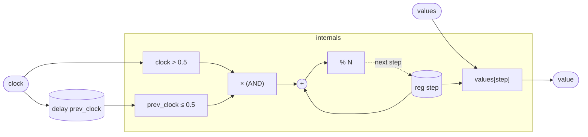

# Sequencer

A step sequencer with edge-triggered advancement. Each time the `clock`
signal rises above 0.5 — transitioning from low to high — the sequencer
moves to the next step and emits the corresponding element of `values`.
Between edges the output holds the current step's value unchanged.

The sequence is circular: after step N−1 the counter wraps to 0. With
the default N=8 this is a classic 8-step sequencer; any integer N works
because the length is a type parameter baked in at instantiation time.

This pattern — a `delay` to hold the previous sample plus a
`(current > threshold) * (prev <= threshold)` product — is the standard
edge-detection idiom in tropical: both conditions are boolean-valued
(0 or 1 as floats), their product is 1 only on the sample where the
transition occurs, and multiplying by that product turns any accumulation
into a gated increment.

## Signal flow



## Internals

Two state elements drive the sequencer:

**`reg step: int = 0`** — the step index. It starts at 0 and is the
only integer register in the program. Each sample the sequencer computes
a candidate next index: `(step + edge) % N`, where `edge` is either 0
(no transition) or 1 (rising edge detected).

**`delay prev_clock = clock init 0`** — a unit-delay copy of `clock`.
On the first sample `prev_clock` is 0 (the `init 0` value). Thereafter
it holds the clock value from the immediately preceding sample. This is
the only memory needed to detect an edge: compare the previous sample to
the current one.

**Edge detection.** The expression `(clock > 0.5) * (prev_clock <= 0.5)`
evaluates to 1 exactly on the sample where `clock` first crosses above
the 0.5 threshold. `clock > 0.5` is 1 while the clock is high;
`prev_clock <= 0.5` is 1 while the previous sample was not yet high.
Their product is 1 only on the exact transition sample. Using
multiplication (rather than a boolean `and`) keeps everything in the
scalar-float IR without introducing a separate boolean type.

**Index read.** `value = values[step]` indexes into the `values` array
at the *current* (pre-advance) step. Because the step register is
updated via `next step` (which takes effect on the *next* sample), the
output reflects the step that was active at the start of this sample —
so the value changes on the sample immediately *following* a rising
edge, one sample after detection.

**Wrap.** `% N` keeps the counter in [0, N−1]. Because `N` is a
type parameter, the modulo is a compile-time constant and the array
access is statically bounded.

## Source

```tropical
program Sequencer<N: int = 8>(clock: unipolar = 0, values: float[N]) -> (value: float) {
  reg step: int = 0
  delay prev_clock = clock init 0
  value = values[step]
  next step = (step + (clock > 0.5) * (prev_clock <= 0.5)) % N
}
```
