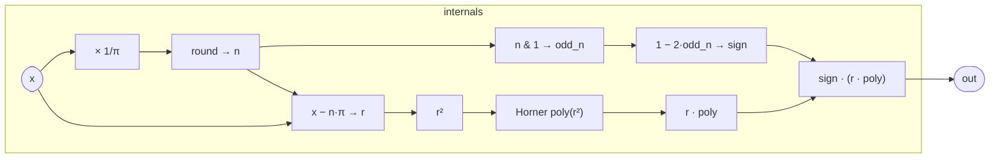

# Sin

A stateless, branchless sine approximation accurate to roughly 15 decimal
digits across the real line. The algorithm is classical: reduce the input to
a small interval by stripping whole half-cycles, look up the sign adjustment
for that half-cycle, and evaluate a single polynomial on the reduced argument.
No transcendental hardware instruction (`fsin`, `sin()`) is called; the result
is a short sequence of scalar multiplies and adds that the JIT can fuse
aggressively.

## Signal flow



## Internals

**Period reduction.** Multiplying `x` by `1/π = 0.3183098861837907` and
rounding to the nearest integer gives `n` — the number of half-cycles
completed. Subtracting `n·π` (where π = `3.141592653589793`) leaves the
reduced argument `r` in the open interval (−π/2, π/2]. Over that interval
sin is monotone and well-approximated by a single polynomial.

**Sign recovery.** The sine function alternates sign with each half-cycle:
sin(r + n·π) = (−1)ⁿ · sin(r). Testing the parity of `n` with a bitwise
AND (`n & 1`) produces `odd_n ∈ {0, 1}`, and `sign = 1 − 2·odd_n` maps
that to +1 or −1 without any conditional branch.

**Polynomial evaluation.** On [−π/2, π/2] the function to approximate is
sin(r)/r (a power series in r² whose constant term is 1), so the output is
`r · P(r²)`. The six coefficients, from lowest to highest power of r², are
the Taylor series terms for sin(r)/r:

| coefficient | equals | power of r² |
|---|---|---|
| `1` | 1/1 | r⁰ |
| `-0.16666666666666666` | −1/3! | r² |
| `0.008333333333333333` | 1/5! | r⁴ |
| `-0.0001984126984126984` | −1/7! | r⁶ |
| `0.0000027557319223985893` | 1/9! | r⁸ |
| `-2.505210838544172e-8` | −1/11! | r¹⁰ |

The `fold` iterates the coefficient array from the highest-order term down to
the constant, using the accumulator update `c + a * r2` — Horner's scheme
in r²: each step multiplies the running sum by r² and adds the next
coefficient. The result is `poly = P(r²)`, and the final output is
`sign * (r * poly)`.

Because `r` lies in (−π/2, π/2] and the Taylor series for sin converges
globally, truncating at the 11th-order term introduces a relative error
below 2⁻⁵² across the reduced interval — within IEEE 754 double-precision
rounding noise for practical audio inputs.

## Source

```tropical
program Sin(x: float = 0) -> (out: float) {
  out = let {
      n: round(x * 0.3183098861837907);
      r: x - n * 3.141592653589793;
      odd_n: n & 1;
      sign: 1 - 2 * odd_n;
      r2: r * r;
      poly: fold([-2.505210838544172e-8, 0.0000027557319223985893,
        -0.0001984126984126984, 0.008333333333333333,
        -0.16666666666666666, 1], 0, (a, c) => c + a * r2)
    } in sign * (r * poly)
}
```
