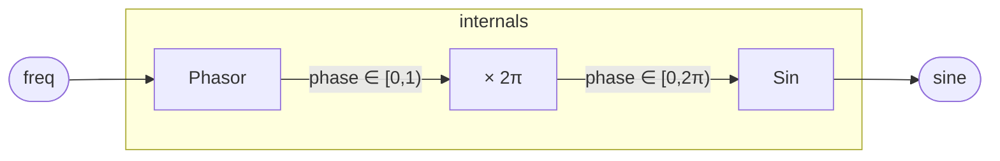

# SinOsc

A sine oscillator built from two stdlib primitives: `Phasor` accumulates
a normalized phase in [0, 1), and `Sin` evaluates a minimax polynomial
approximation of the sine over that range.  The result is a clean sine
wave at any frequency up to Nyquist, with no calls to a transcendental
`sin` function in the compiled kernel — only additions, multiplications,
and a modulo wrap.

## Signal flow



## Internals

**Phasor.**  `Phasor` holds a single register `p` initialized to 0.
Each sample it outputs the current phase, then advances: `next p = (p +
freq / sampleRate()) % 1`.  The output `phase` is therefore the
*pre-increment* value — a sawtooth ramp in [0, 1) that completes one
cycle every `sampleRate() / freq` samples.

**Phase scaling.**  The phasor's [0, 1) range is mapped to [0, 2π) by
multiplying by `6.283185307179586` — the 64-bit float closest to 2π.
This is the full-cycle convention: the polynomial's period-reduction is
in units of π (see below), and a [0, 2π) input covers exactly one
full sine cycle before the phasor wraps.

**Sin polynomial.**  `Sin` performs Payne–Hanek-style range reduction and
then evaluates a degree-11 Horner-form polynomial:

1. `n = round(x / π)` — the nearest half-period index.  The constant
   `0.3183098861837907` is `1/π` in 64-bit float.
2. `r = x − n·π` — the reduced argument, in [−π/2, π/2].
3. `odd_n = n & 1` — parity of the half-period; `sign = 1 − 2·odd_n`
   gives +1 on even half-periods, −1 on odd, handling the sign flip that
   occurs every π.
4. A degree-11 Horner polynomial in `r²` approximates `sin(r)/r`; the
   six coefficients match the Taylor series through the `r^11` term
   (divided by the respective factorials: 1, −1/6, 1/120, −1/5040,
   1/362880, −1/39916800).  Multiplying the polynomial by `r` gives
   `sin(r)`, and multiplying by `sign` undoes the range-reduction sign
   flip.

Because `Sin` is pure combinational (no registers, no instance state),
`SinOsc` as a whole carries exactly the state of `Phasor`: one register
`p`.

## Source

```tropical
program SinOsc(freq: freq = 440) -> (sine: float) {
  ph = Phasor(freq: freq)
  sin = Sin(x: 6.283185307179586 * ph.phase)
  sine = sin.out
}
```
