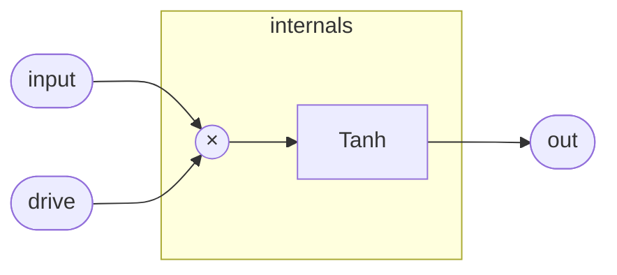

# SoftClip

A memoryless waveshaper: multiply the input by `drive`, pass the result
through `Tanh`, and output the result. There is no feedback and no state
— every sample is independent.

The character of the distortion follows the tanh curve. Near zero the
curve is nearly linear (`tanh(x) ≈ x` for small `x`), so low-level
signals pass through with minimal coloration. As `drive` increases the
pre-scaled signal moves into the shoulders of the curve, introducing
progressively stronger odd-harmonic saturation. At very high drive the
output approaches ±1 asymptotically, never hard-clipping.

`Tanh` in the stdlib is a rational Padé approximant —
`c·(27 + c²) / (27 + 9c²)` with `c = clamp(x, −3, 3)` — so the
waveshaper lowers entirely to scalar arithmetic; there are no
transcendental function calls in the compiled kernel.

## Signal flow



## Internals

`drive * input` forms the single argument to `Tanh`. The `Tanh`
instance clamps its input to [−3, 3] before evaluating the rational
approximant, so the effective input range that produces distinct outputs
is `|input| ≤ 3 / drive`. Beyond that the output saturates at the
tanh(±3) ceiling (≈ ±0.9951), providing soft limiting rather than hard
clipping.

Choosing `drive`:

| drive | character |
|-------|-----------|
| ≤ 0.3 | nearly linear — mild warmth |
| 1     | unity; tanh curve centered on ±1 amplitude |
| 3     | full saturation for 0 dBFS input |
| > 3   | heavy limiting; signal above unity is near-constant ±1 |

Because the shaper is stateless it can be placed anywhere in a signal
chain without introducing latency or startup transients.

## Source

```tropical
program SoftClip(input: signal = 0, drive: float = 1) -> (out: signal) {
  tanh = Tanh(x: drive * input)
  out = tanh.out
}
```
