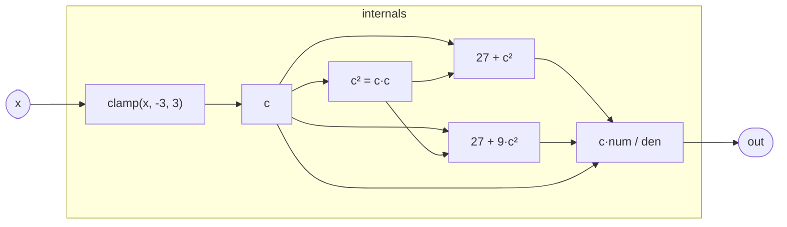

# Tanh

A stateless, branchless approximation to the hyperbolic tangent. The
kernel emits no transcendental function calls — only multiply, add, and
divide — making it suitable for use inside tight inner loops and as a
drop-in saturator inside filter feedback paths (see `OnePole`).

The domain is clamped to `[-3, 3]` before evaluation. `tanh(3) ≈ 0.9951`,
so the clamp introduces at most 0.5% error at the output boundary; for
any realistic audio signal the clamp is never reached.

## Signal flow



## Internals

The rational form is:

```
tanh(x) ≈ c · (27 + c²) / (27 + 9·c²)     where c = clamp(x, -3, 3)
```

This is a degree-3/degree-2 rational approximation (in terms of `c²`)
that exactly matches `tanh` at `x = 0` and `x = ±3`:

- **At `x = 0`:** numerator is 0; output is 0. ✓
- **At `x = ±3`:** `c = ±3`, `c² = 9`; output = `±3·36/108 = ±1`. ✓
- **At `x = ±1`:** output ≈ `1·28/36 ≈ 0.778`; `tanh(1) ≈ 0.762`. Error < 2%.

The `let` expression introduces two named sub-expressions — `c` (the
clamped input) and `c2` (its square) — that the compiler is free to
CSE into a single computation of each. The final expression references
both without recomputing them, keeping the op count to roughly: one
clamp, one multiply (c²), two fused-multiply-adds (numerator,
denominator), and one divide.

The approximation is odd-symmetric (`f(−x) = −f(x)`) and monotone on
`[−3, 3]`, which preserves the qualitative character of tanh: no
spurious oscillation or sign flip that would destabilize a feedback loop.

## Source

```tropical
program Tanh(x: float = 0) -> (out: float) {
  out = let { c: clamp(x, -3, 3); c2: c * c } in c * (27 + c2) / (27 + 9 * c2)
}
```
