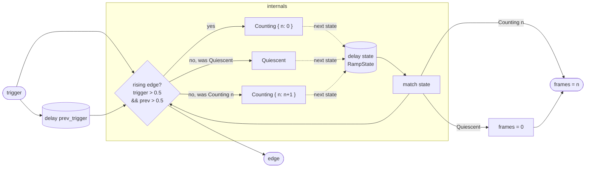

# TriggerRamp

Counts how many samples have elapsed since the most recent rising edge of a
gate or trigger signal. The output `frames` is 0 while the program is idle
and ramps up — one integer step per sample — from the moment a rising edge
arrives. A simultaneous one-sample pulse appears on `edge` at each rising
edge.

The primary use is converting a clock or gate source into a time reference:
dividing `frames` by `sampleRate()` gives elapsed seconds; comparing it to a
threshold detects a specific duration after the trigger. Chained with a
`Sequencer` or `SampleHold`, it enables triggered envelopes or time-based
modulations built entirely from arithmetic on the frame count rather than
from a dedicated envelope generator.

A retrigger — a new rising edge while already counting — resets `frames` to
0 immediately, so the count always reflects time from the *most recent* onset.

## Signal flow



## Internals

**Rising-edge detection.** `prev_trigger` is a unit-delay register holding
the trigger value from the previous sample. A rising edge is defined as the
condition `trigger > 0.5 && prev_trigger <= 0.5` — a 0.5 threshold with
hysteresis-by-convention (the current sample is high, the previous was not).
`edge` outputs the arithmetic equivalent of this boolean: `(trigger > 0.5) *
(prev_trigger <= 0.5)`, which is 1.0 on the exact rising-edge sample and 0.0
on every other sample. This is a strict one-sample pulse regardless of how
long the gate stays high.

**Enum state machine.** The `state` register holds a sum type with two
variants:

- `Quiescent` — no trigger has arrived since startup, or the program has
  never received a trigger. `frames` is 0 in this state.
- `Counting { n: int }` — `n` samples have elapsed since the last rising
  edge. `frames` is `n`.

The transition table, evaluated every sample:

| Current state | Rising edge? | Next state |
|---|---|---|
| `Quiescent` | yes | `Counting { n: 0 }` |
| `Quiescent` | no | `Quiescent` |
| `Counting { n }` | yes (retrigger) | `Counting { n: 0 }` |
| `Counting { n }` | no | `Counting { n: n + 1 }` |

Both `match` arms check the rising-edge condition first via `select`, so a
retrigger from any state — including mid-count — immediately resets `n` to 0.
The count therefore always measures time from the *most recent* onset.

**Output `frames`.** A second `match` on the (just-written-back) `state`
exposes `n` for `Counting` variants and 0 for `Quiescent`. Because `state` is
a `delay` (not `reg`), the `state` visible to the `frames` and `edge`
expressions on any given sample is the state computed on the *previous* sample
— the standard unit-delay semantics. This means `frames` is 0 on the
rising-edge sample itself (state just transitioned to `Counting { n: 0 }` and
that will be visible next sample), and 1 on the following sample.

**No stdlib dependencies.** TriggerRamp is self-contained; it uses only
built-in arithmetic, comparison, and the `select`/`match` language forms.

## Source

```tropical
program TriggerRamp(trigger: signal = 0) -> (frames: float, edge: float) {
  enum RampState { Quiescent, Counting(n: int) }
  delay prev_trigger = trigger init 0
  delay state: RampState = match state { Quiescent => select(trigger > 0.5 && prev_trigger <= 0.5, Counting { n: 0 }, Quiescent { }), Counting { n: n } => select(trigger > 0.5 && prev_trigger <= 0.5, Counting { n: 0 }, Counting { n: n + 1 }) } init Quiescent { }
  frames = match state { Quiescent => 0, Counting { n: n } => n }
  edge = (trigger > 0.5) * (prev_trigger <= 0.5)
}
```
