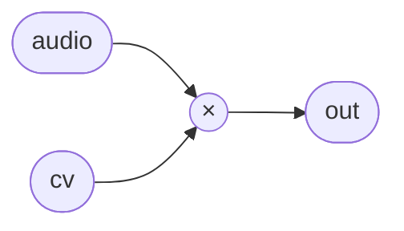

# VCA

A voltage-controlled amplifier in its purest form: `out = audio × cv`. There is no
register, no smoothing, and no nonlinearity — the control voltage is applied as a
direct linear gain every sample. This is intentional. Smoothing, exponential
conversion, and anti-click envelopes belong in whatever drives the `cv` input, not
inside the VCA itself. Keeping multiplication and modulation separate means the same
module works equally well as a tremolo (audio-rate `cv`), an envelope-controlled
amplitude stage, or a ring modulator when `cv` is itself an oscillator signal.

At `cv = 1` the signal passes through at unity. Negative `cv` inverts polarity.
Values above 1 amplify. There is no built-in clamp, so output amplitude is
unbounded — the caller is responsible for keeping signal levels sensible if the
downstream path can clip.

## Signal flow



## Internals

No state, no instances. The body is a single multiply. The compiler lowers this to
one scalar multiply instruction in the kernel; the JIT fuses it with adjacent
operations when the VCA appears as part of a larger session graph. The simplicity is
the point: any modulation shape can be imposed from outside without fighting a
built-in character.

## Source

```tropical
program VCA(audio: float = 0, cv: float = 0) -> (out: float) {
  out = audio * cv
}
```
