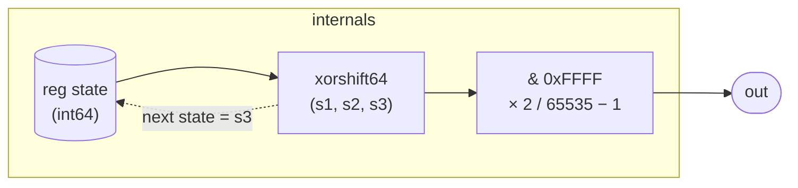

# WhiteNoise

A stateless-looking white-noise source: every sample it advances a
64-bit xorshift PRNG, masks the lower 16 bits of the new state, and
maps those bits linearly to the range [−1, 1]. No inputs, no
parameters — just a single integer register that evolves
deterministically from a fixed seed.

The underlying algorithm is **xorshift64** (Marsaglia 2003). Three
XOR-shift steps with constants (13, 7, 17) produce full-period
2⁶⁴ − 1 sequences and pass the standard PRNG test suites. The
period is long enough that audio applications never hear a repeat.
The output quantises to 65 536 levels (16-bit resolution), which is
below the noise floor of 24-bit audio — adequate for synthesis and
aliasing-free for perceptual use.

## Signal flow



## Internals

The single register `state` is typed as `int` and seeded with the
nonzero constant `88172645463325250`. Each sample:

1. **Shift left 13, XOR:** `s1 = state ^ (state << 13)`
2. **Shift right 7, XOR:** `s2 = s1 ^ (s1 >> 7)`
3. **Shift left 17, XOR:** `s3 = s2 ^ (s2 << 17)`

`s3` is both the next state and the raw sample value. The three
(13, 7, 17) triple is the standard parameter set for 64-bit xorshift;
it satisfies the full-period primitive polynomial condition over GF(2).

**Output mapping.** The lower 16 bits are extracted with `& 65535`
(= `& 0xFFFF`), multiplied by 2, divided by 65535, then shifted
down by 1: `(s3 & 65535) * 2 / 65535 - 1`. This maps the uniform
unsigned integer range [0, 65535] to the float range [−1, 1] with
the mid-point at 0. (The formula yields exactly −1 at 0 and
≈ +1.000015 at 65535 — within floating-point rounding of +1.)

**Code duplication.** The kernel computes the three-step xorshift
twice — once for `out` (all three steps plus the mask/scale) and
once for `next state` (all three steps, no mask). This is intentional
in tropical's flat IR: `let`-bound local names are scoped to their
expression and cannot be shared across two top-level assignments.
The compiler CSEs the duplicated arithmetic within a single sample.

## Source

```tropical
program WhiteNoise() -> (out: float) {
  reg state: int = 88172645463325250
  out = let { s1: state ^ state << 13 } in let { s2: s1 ^ s1 >> 7 } in let { s3: s2 ^ s2 << 17 } in (s3 & 65535) * 2 / 65535 - 1
  next state = let { s1: state ^ state << 13 } in let { s2: s1 ^ s1 >> 7 } in s2 ^ s2 << 17
}
```
