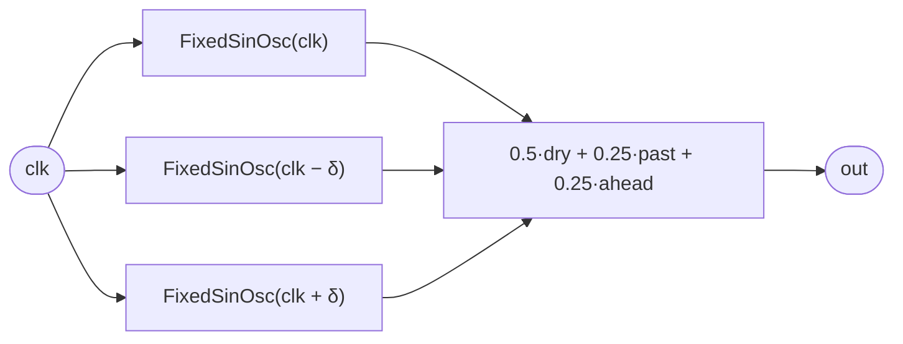

# FlangeSin

Phase-0 spike for the voice-ports sprint: the desugaring **target** of a generic
`Flanger<V>` with `V = FixedSinOsc`. Structurally identical to `ReversibleComb`,
but the voice is a `FixedSinOsc` instead of a `ModalVoice` — three instances of
one clock-parametric voice, evaluated at the dry clock and at `±delta` warps of
it, summed. It exists to prove the warp core works for an arbitrary
clock-parametric voice before the surface (`voice` ports, `v(clk)` application)
is built around it. No state anywhere — the taps are coordinate reads, so it
scrubs and reverses exactly when `clk` does.

## Signal flow



## Source

```tropical
program FlangeSin(clk: clock = clock(), freq: freq = 220, depth: float = 0.0007) -> (out: float) {
  dry = FixedSinOsc(freq: freq, clk: clk)
  past = FixedSinOsc(freq: freq, clk: clk - toInt(depth * sampleRate() * 4294967296))
  ahead = FixedSinOsc(freq: freq, clk: clk + toInt(depth * sampleRate() * 4294967296))
  out = 0.5 * dry.sine + 0.25 * past.sine + 0.25 * ahead.sine
}
```
