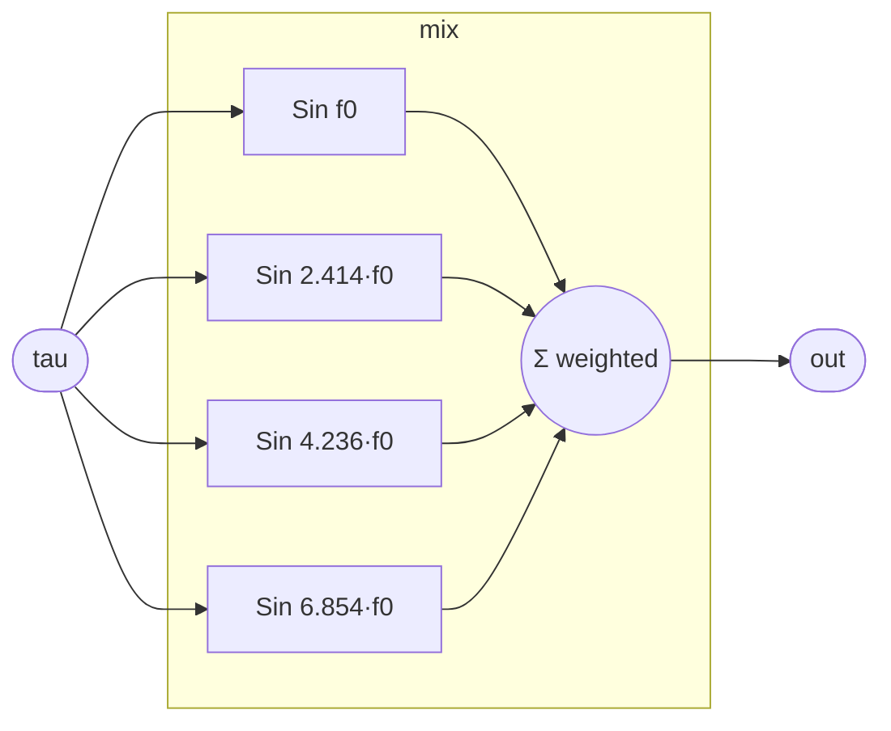

# ModalVoice

A closed-form modal voice: a sum of undamped sinusoidal partials at
incommensurate frequencies, evaluated as a pure function of the time
coordinate `tau`. Because each partial is `sin(2π · f · tau)` and nothing
here holds state, the whole voice is a pure function of `tau` — it can be
evaluated at *any* `tau` (forward, backward, jumped) and it reverses exactly
when `tau` reverses. This is the "torus cousin": the partials are the modes,
their incommensurate ratios make the sum shimmer and never quite repeat.

The partials are *undamped* on purpose. Damping (`e^(-α·tau)`) is the
irreversible direction — read backward it grows without bound — so a
conservative, energy-preserving voice is the one that scrubs cleanly in both
directions and stays bounded. Striking and decay live on the stateful side
of the boundary; this voice is the reversible core.

## Signal flow



## Internals

Four `Sin` partials at `f0 · {1, 1+√2, 2+√5, ...}` — irrational ratios so no
two partials are harmonically locked and the beat pattern never closes. Each
partial reads `tau` directly: `Sin(x: 2π · f · tau)`. `Sin` performs its own
range reduction, so large or negative `tau` is handled with full precision —
which is exactly what makes scrubbing (and negative time) work.

The weights `0.4, 0.24, 0.16, 0.1` sum to `0.9 < 1`, keeping the voice below
clipping. There is no register anywhere in this program: it is purely
combinational in `tau`.

## Source

```tropical
program ModalVoice(tau: float = 0, f0: freq = 110) -> (out: float) {
  s1 = Sin(x: 6.283185307179586 * f0 * tau)
  s2 = Sin(x: 6.283185307179586 * f0 * tau * 2.414213562373095)
  s3 = Sin(x: 6.283185307179586 * f0 * tau * 4.23606797749979)
  s4 = Sin(x: 6.283185307179586 * f0 * tau * 6.854101966249685)
  out = 0.4 * s1.out + 0.24 * s2.out + 0.16 * s3.out + 0.1 * s4.out
}
```
