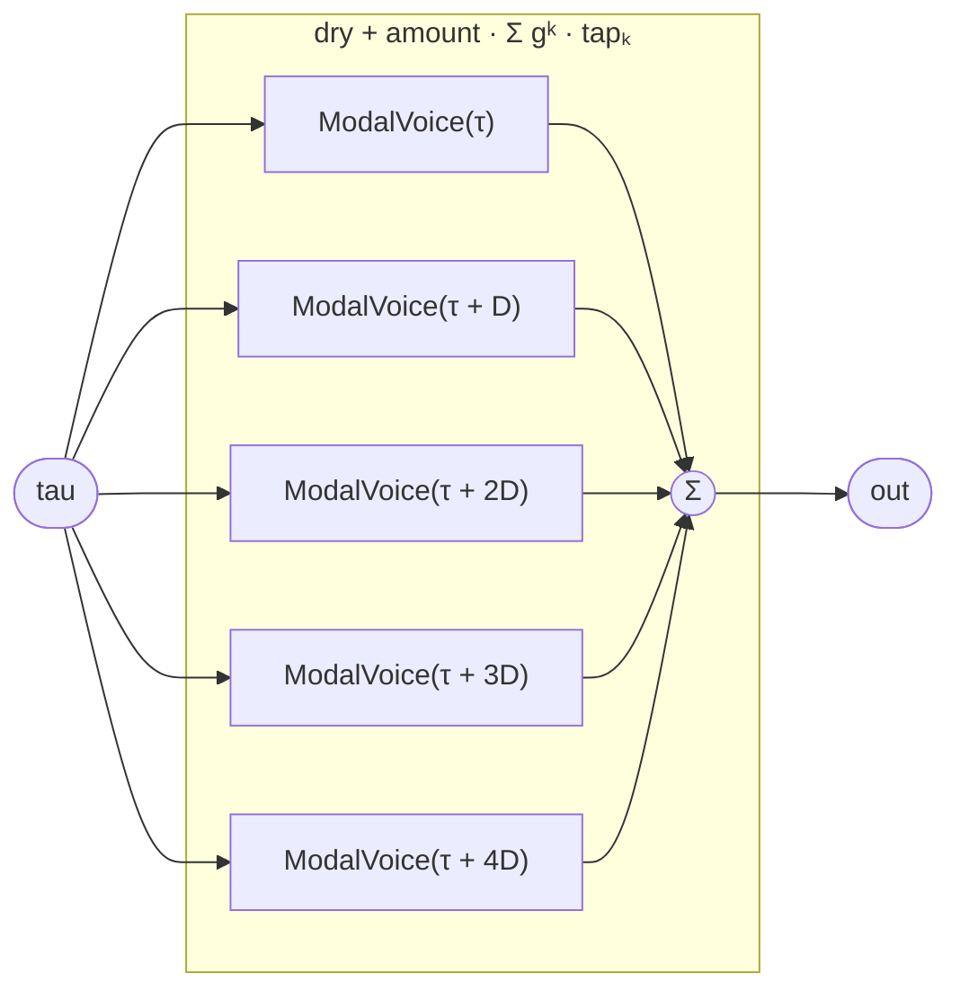

# ReverseReverb

A reverb whose tail swells **into** a hit from before it — built the
closed-form way, with no buffer and no tape-flip sandwich. A causal
feedback comb `y(τ) = x(τ) + g·y(τ − D)` reads the *past*; reverse it to
`y(τ) = x(τ) + g·y(τ + D)` and unroll it (the source is closed-form, so
its future is computable) into a finite geometric series of **future**
taps:

```
y(τ) = x(τ) + amount · Σ_{k=1..K} gᵏ · x(τ + k·D)
```

Each tap re-evaluates the closed-form source `D` seconds *ahead*,
weighted by `gᵏ`. Because every tap is a pure function of `τ` and the
decay `g` rides the tap *index* (spatial), not the coordinate
(temporal), the whole effect reverses exactly when `τ` reverses — the
bloom flips from before the hit to after it. This is the gesture a
stream provably cannot offer: it reads the source's future, which a
recording does not contain (hence the sandwich trick existed). Here it
is just more evaluations of `ModalVoice`.

`K = 4` future taps are unrolled explicitly (sub-program instances can't
be generated by a combinator — the `Phaser16` pattern). The host
transport supplies the navigable `tau` and may wrap this in the
anchored-phase / event-envelope machinery; this program is the
reversible reverb core.

## Signal flow



## Internals

Five `ModalVoice` instances at `τ, τ+D, τ+2D, τ+3D, τ+4D` (`D = spacing`
seconds). The dry tap (`τ`) carries weight 1; each future tap `k` carries
`amount · gᵏ` with `g = decay`. The future taps are acausal reads — they
sample the source *ahead* of now — which only type-checks because the
source has a computable future. No register anywhere: the reverb holds no
buffer, only five evaluations of a closed-form voice, so it scrubs and
reverses with the rest of the patch.

`spacing` defaults to `0.045` s (45 ms) and `decay` to `0.72` (each tap
≈ 0.72× the previous). Raising `amount` and `spacing` makes the
pre-bloom obvious — each hit swells up from silence. Reverse `τ` and the
same taps trail the hit instead: one program, both reverbs.

## Source

```tropical
program ReverseReverb(
  tau: float = 0,
  f0: freq = 110,
  spacing: float = 0.045,
  decay: float = 0.72,
  amount: float = 0.7
) -> (out: float) {
  dry  = ModalVoice(tau: tau, f0: f0)
  tap1 = ModalVoice(tau: tau + spacing, f0: f0)
  tap2 = ModalVoice(tau: tau + 2 * spacing, f0: f0)
  tap3 = ModalVoice(tau: tau + 3 * spacing, f0: f0)
  tap4 = ModalVoice(tau: tau + 4 * spacing, f0: f0)
  out = dry.out + amount * (
          decay * tap1.out
        + decay * decay * tap2.out
        + decay * decay * decay * tap3.out
        + decay * decay * decay * decay * tap4.out)
}
```
