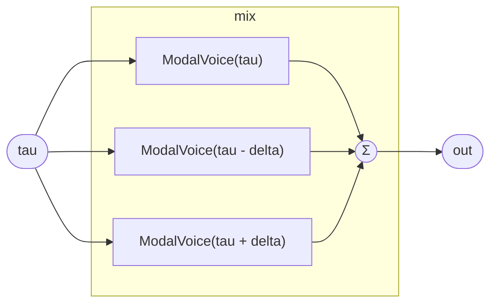

# ReversibleComb

A comb / flange built the reversible way: instead of a ring-buffer delay
(`Delay`, which stores *wall-clock* past samples and cannot be scrubbed or
read ahead), each tap **re-evaluates** the closed-form source at an offset
time coordinate. The dry tap reads `tau`, the past tap reads `tau - delta`,
and the *ahead* tap reads `tau + delta` — the future. Reading the future is
free here because the source is a closed-form function of `tau`, not a
recording: this is the "wormhole" tap. Summed, the three give a comb whose
notches you can sweep, and because every tap is a pure function of `tau`, the
whole effect reverses exactly when `tau` reverses.

This is the concrete difference between a buffer delay and an offset read.
`tau + delta` is unreachable by `Delay` (the future was never recorded);
here it is just another evaluation of `ModalVoice`.

## Signal flow



## Internals

Three `ModalVoice` instances at `tau`, `tau - delta`, `tau + delta`. The
`ahead` instance is an acausal read — it samples the source ahead of "now" —
which only type-checks because the source has a computable future. Weights
`0.5 / 0.25 / 0.25` sum to 1. No state: the comb carries no buffer, only
three evaluations of a closed-form voice, so it scrubs and reverses with the
rest of the patch.

`delta` defaults to `0.0007` s (~0.7 ms, ~33 samples at 48 kHz) — a short
flange-range comb. Sweeping `delta` toward zero passes the ahead and past
taps *through* the dry one: a through-zero comb, the reversible analogue of
through-zero flanging.

## Source

```tropical
program ReversibleComb(tau: float = 0, f0: freq = 110, delta: float = 0.0007) -> (out: float) {
  dry = ModalVoice(tau: tau, f0: f0)
  past = ModalVoice(tau: tau - delta, f0: f0)
  ahead = ModalVoice(tau: tau + delta, f0: f0)
  out = 0.5 * dry.out + 0.25 * past.out + 0.25 * ahead.out
}
```
