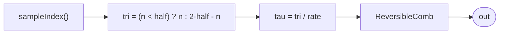

# ReversibleProbe

The self-contained reversibility witness — an *automated scrub*. It drives a
palindromic time coordinate from the sample counter: `tau` ramps forward to
sample `half`, then runs backward, tracing the same coordinates in reverse.
Because the downstream patch (`ReversibleComb` over `ModalVoice`) is a pure
function of `tau`, and the two halves visit the *identical* `tau` values, the
rendered output is a **bit-exact palindrome** about sample `half`:
`out[half + k] == out[half - k]`. That equality is the reversibility claim
made testable — reverse the time coordinate and you reverse the sound,
sample for sample, with no drift.

This is what `VelocityClock` does live, but scripted and exact: the triangle
`tau` is a *coordinate* (computed by a symmetric formula), not an accumulated
state, so the return trip retraces the same floating-point values rather than
re-accumulating them. The reversibility test renders this program and asserts
the palindrome.

## Signal flow



## Internals

**Auto-scrub.** A `let` binds `nf = toFloat(sampleIndex())` (the running
sample count) and `tri = select(nf < half, nf, 2*half - nf)`, a triangle in
sample units: `0, 1, …, half, …, 1` — it climbs to `half` and descends, and
it is exactly symmetric, `tri(half + k) == tri(half - k)`, because
`2*half - (half+k)` and the descending branch both equal the integer
`half - k` (exact in float for counts below 2^53). Dividing by `sampleRate()`
gives `tau` in seconds.

**Pure downstream.** `ReversibleComb` (and the `ModalVoice` partials beneath
it) hold no state, so `out` at sample `n` depends only on `tau(n)` — hence on
`n` alone. Equal `tau` ⟹ equal output, bit-for-bit. The whole program has no
register: the only time-dependence is the (monotonic) sample counter, folded
into a symmetric coordinate.

At the default `half = 2048`, render `2*half = 4096` samples and the output
is a palindrome about index 2048.

## Source

```tropical
program ReversibleProbe(half: float = 2048, f0: freq = 110, delta: float = 0.0007) -> (out: float) {
  comb = ReversibleComb(
    clk: let {
        nf: toFloat(sampleIndex());
        tri: select(nf < half, nf, 2 * half - nf)
      } in toInt(tri * 4294967296),
    f0: f0,
    delta: delta)
  out = comb.out
}
```
