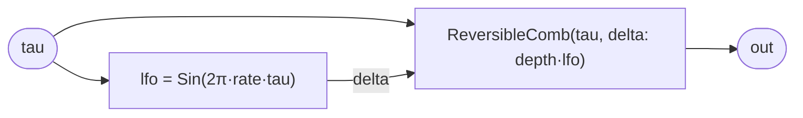

# ThroughZeroFlanger

A through-zero flanger built the reversible way — no swept delay line, no
buffer crossing a fixed tap. `ReversibleComb` already gives a comb whose two
offset taps read `tau - delta` and `tau + delta`; freeze `delta` and it is a
static comb. **Unfreeze it** — drive `delta` with a low-frequency oscillator —
and the comb's notches sweep: a flanger. Because the LFO is itself a function
of `tau` (not wall-clock), the whole effect stays a pure function of the time
coordinate, so it scrubs and reverses with the rest of the patch.

The *through-zero* is automatic. The LFO is **bipolar**, so `delta` swings
through zero each cycle. At the zero crossing the past tap (`tau - delta`) and
the ahead tap (`tau + delta`) coincide on `tau` and then *swap roles* — the tap
that was lagging becomes leading. That role-swap is the through-zero event: the
comb spacing opens to infinity at the crossing and the notches sweep down
through DC, the signature barber-pole sound. The *ahead* tap is an acausal read
— it samples the source ahead of "now" — which only type-checks because the
source `ModalVoice` has a computable future. A streamed delay can never offer
it; here it is just another evaluation of a closed-form voice.

This is the difference made musical: a buffer flanger sweeps a recorded past;
this sweeps a *coordinate*, forward and backward symmetrically, and the future
half of the sweep is as real as the past half.

## Signal flow



## Internals

One `Sin` instance computes the LFO directly from `tau`:
`lfo = Sin(2π · rate · tau)`, bipolar in `[-1, 1]`. Its output scales `depth`
to a signed delay `depth · lfo`, which feeds `ReversibleComb`'s `delta`. The
comb does the rest — dry (`tau`), past (`tau - delta`), ahead (`tau + delta`),
summed `0.5 / 0.25 / 0.25`. No state anywhere: the LFO is a coordinate read,
the comb holds no buffer, so the flanger scrubs and reverses exactly when `tau`
does (witnessed by `ThroughZeroFlangerProbe`).

`rate` defaults to `0.3` Hz (a slow sweep) and `depth` to `0.0007` s (~0.7 ms,
the flange range). Because `delta` is bipolar, the effective tap offset crosses
zero twice per LFO period — two through-zero passes per cycle. Raising `rate`
speeds the sweep; raising `depth` widens the comb and deepens the barber-pole.

## Source

```tropical
program ThroughZeroFlanger(tau: float = 0, f0: freq = 110, depth: float = 0.0007, rate: freq = 0.3) -> (out: float) {
  lfo = Sin(x: 6.283185307179586 * rate * tau)
  comb = ReversibleComb(tau: tau, f0: f0, delta: depth * lfo.out)
  out = comb.out
}
```
