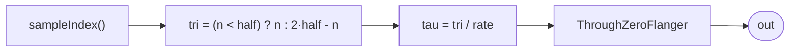

# ThroughZeroFlangerProbe

The reversibility witness for `ThroughZeroFlanger` — the same automated scrub
as `ReversibleProbe`, pointed at the flanger instead of the bare comb. It
drives a palindromic `tau` from the sample counter (ramp forward to sample
`half`, then back), feeds it to `ThroughZeroFlanger`, and the render is a
**bit-exact palindrome** about `half`: `out[half + k] == out[half - k]`.

The point the flanger adds over the comb: the swept LFO is *also* a function of
`tau`, so unfreezing `delta` does not introduce any state. If the LFO held an
accumulator (a real oscillator latching phase), the forward and reverse halves
would diverge and the palindrome would break. It does not — `lfo` is
`Sin(2π·rate·tau)`, recomputed from the coordinate each sample — so the
flanger reverses exactly, sweep and all.

## Signal flow



## Internals

A `let` binds `nf = toFloat(sampleIndex())` and
`tri = select(nf < half, nf, 2*half - nf)`, a triangle in sample units that is
exactly symmetric about `half`. Dividing by `sampleRate()` gives `tau` in
seconds. `ThroughZeroFlanger` downstream holds no state, so `out` at sample `n`
depends only on `tau(n)` — equal `tau` ⟹ equal output, bit-for-bit.

`lfoRate` is raised to `6` Hz here (vs the flanger's slow default) so the sweep
visibly moves within the short probe window — the palindrome must hold *while
the comb is sweeping*, which is the stronger claim. At the default
`half = 2048`, render `2*half = 4096` samples; the output is a palindrome about
index 2048.

## Source

```tropical
program ThroughZeroFlangerProbe(half: float = 2048, f0: freq = 110, depth: float = 0.0007, lfoRate: freq = 6) -> (out: float) {
  fl = ThroughZeroFlanger(
    clk: let {
        nf: toFloat(sampleIndex());
        tri: select(nf < half, nf, 2 * half - nf)
      } in toInt(tri * 4294967296),
    f0: f0,
    depth: depth,
    rate: lfoRate)
  out = fl.out
}
```
