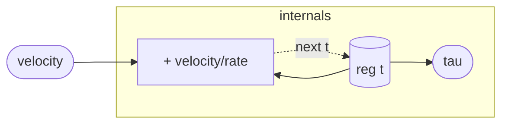

# VelocityClock

The one stateful element of the reversible regime: a time coordinate `tau`
that advances by a *signed* `velocity` each sample. At `velocity = 1` it is
ordinary forward time (`tau` in seconds). At `velocity = 0` time freezes; at
`velocity = -1` it runs backward; at `velocity = 2` it scrubs forward at
double speed. Everything else in the regime is a pure, stateless function of
`tau`, so driving this single knob negative reverses the entire patch — the
"finger on the tape" is one wire into this clock.

Unlike `Phasor`, there is no `% 1` wrap: `tau` is an unbounded coordinate,
not a periodic phase. Waveshapers read it through their own frequency
scaling and do their own period reduction (see `Sin`). Confining *all* state
to this accumulator is the whole discipline — a patch built only from
`VelocityClock` plus closed-form functions of its `tau` is reversible by
construction, because reversing `tau` reverses every downstream value.

## Signal flow



## Internals

One register, `t`, is the entire clock. Each sample:

1. `tau = t` — the current (pre-update) coordinate is exposed, zero-latency,
   so downstream closed-form modules see the same `tau` that drives this
   sample.
2. `next t = t + velocity / sampleRate()` — the coordinate steps by the
   signed per-sample increment. `velocity` is a live control: write it from
   the host (`set_slot` on `param:velocity`) to scrub, freeze, or reverse.

Reversal through the *accumulator* is exact to within floating-point drift
(repeated `+d` then `-d` need not retrace bit-for-bit). Exact, bit-for-bit
reversibility comes from treating `tau` as a *coordinate* — supplying a
symmetric trajectory and evaluating the closed-form patch at it — which is
what `ReversibleProbe` does and what the reversibility test asserts.

## Source

```tropical
program VelocityClock(velocity: float = 1) -> (tau: float) {
  reg t = 0
  tau = t
  next t = t + velocity / sampleRate()
}
```
