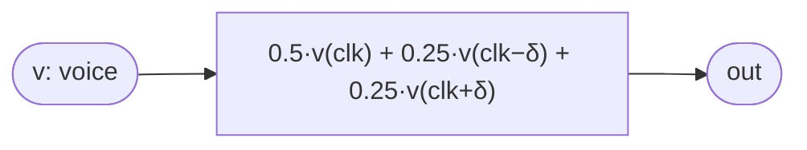

# Flanger

Voice-ports render-proof fixture (Phase 1): the **generic** flanger as a
pointfree morphism over a `voice` input — the same three-tap structure as
`FlangeSin`, but the voice is the input `v` rather than a hardcoded
`FixedSinOsc`. `diffcli voice-desugar` binds `v → FixedSinOsc` and must
reproduce `FlangeSin` exactly.

## Signal flow



## Source

```tropical
program Flanger(v: voice, clk: clock = clock(), freq: freq = 220, depth: float = 0.0007) -> (out: float) {
  out = 0.5 * v(clk) + 0.25 * v(clk - toInt(depth * sampleRate() * 4294967296)) + 0.25 * v(clk + toInt(depth * sampleRate() * 4294967296))
}
```
